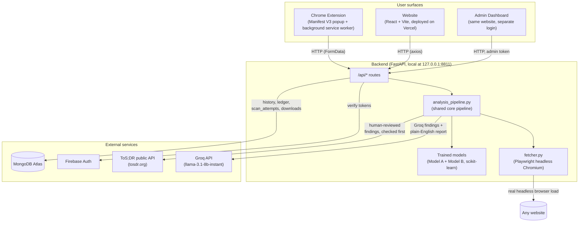

# PrivacyLens — Project Bible

**Purpose of this document**: a single, exhaustive source of truth for the
PrivacyLens project — technical, business, historical, and strategic — written
so that someone with no other access to the codebase, the author, or any other
source could still answer any real question about the project. Every claim
below is traceable to something found in the repository itself (source code,
config files, in-code comments) or to the accumulated session record of how
this project was built (see "A note on sources," immediately below). Where
something is inferred rather than directly found, that is stated explicitly.

**A note on sources**: this project has **no git repository** (`git status`
from the project root, `backend/`, and `frontend/` all return "fatal: not a
git repository") — there is no commit history, no CHANGELOG, and no
pre-existing README beyond the default Vite scaffold text in
`frontend/README.md`. The "History & Decisions" section of this document is
therefore reconstructed from the project's persistent session memory (an
external, running record of every build session, bug found, and decision
made on this project over time) rather than from commit messages, since none
exist. This is itself a notable fact about the project's current state — see
Section 8 ("Current State") and Section 9's risk list.

---

## 1. Executive Summary

**PrivacyLens** is a privacy-policy analyzer available as both a **Chrome
browser extension** and a **standalone website**, backed by a shared **FastAPI
+ MongoDB backend**. Point it at any company's website (or paste a policy
directly), and it automatically finds that company's actual privacy policy —
even if you only gave it the homepage — and turns it into:

- A single 0–100 **risk score** ("X% Risk" — higher means riskier), with a
  Low / Moderate / High label.
- A plain-English list of **findings** — the specific things wrong (or right)
  with the policy, each tagged by severity and by which mechanism found it.
- A **Data Practices** breakdown — which categories of personal data
  (contact info, location, financial info, browsing activity, device
  identifiers, cookies/tracking) the policy discloses collecting, and whether
  it says that data gets shared with third parties.
- A **Data Exposure Ledger** — a running, cross-scan record of which specific
  companies you've personally granted which category of data to, built
  automatically as you scan more sites over time.
- Detection of **manipulative "dark patterns"** in the policy's own wording
  (forced consent, vague sharing language, no opt-out, data hoarding, etc.).
- An AI assistant you can ask direct follow-up questions to about the
  specific policy just scanned.

**Who it's for**: an ordinary consumer who is about to sign up for a service,
install an app, or just wants to know "is this company going to sell my
data," and does not have the time, patience, or legal background to read a
12-page privacy policy themselves. It is explicitly **not** built as a legal
compliance tool for businesses (no jurisdiction-specific legal advice is
given, and the tool is careful to avoid GDPR-only assumptions — see Section
5's disclosure-checks history for a concrete example of a check that was
deliberately removed for exactly this reason).

**Why it exists / what problem it solves**: privacy policies are long,
written in legal language, and deliberately (or just practically) avoid
being read. Most people click "I agree" without reading a word. PrivacyLens's
bet is that a tool which (a) never needs the user to find or paste the right
page themselves, (b) never asks the user to just trust an AI's raw opinion,
and (c) shows its work (why something was flagged, and whether a human,
a trained model, or an AI made that specific call) is meaningfully more
trustworthy and more usable than either reading the policy yourself or
pasting it into a generic chatbot.

**What makes it different from "just read it yourself" or "ask ChatGPT"**:

1. **It doesn't rely on AI alone.** Every scan checks
   [ToS;DR](https://tosdr.org) (Terms of Service; Didn't Read) — a
   community project where real human volunteers have already read and
   rated thousands of real companies' policies — *before* ever asking an
   LLM to judge anything. AI (Groq) is only used when a site has no ToS;DR
   coverage, and even then it's cross-checked by a second, independently
   trained classifier (see "Model B" in Section 5) rather than taken at
   face value.
2. **It finds the actual policy on its own.** Both the website and the
   extension will automatically discover and follow a site's real privacy
   policy / terms / cookie-policy link — you can give it just a homepage URL
   or a domain, not the exact sub-page. This was a deliberate, hard-won
   engineering investment (see Section 4's "Auto-discovery" subsection and
   Section 7's history) specifically so a non-technical user is never stuck
   hunting for the right page.
3. **Its risk score is engineered to be monotonic and proportionate**, not a
   black-box LLM opinion — see Section 5 for the exact formula, including a
   real mathematical bug (non-monotonic scoring) that was found and fixed
   during this project's life.
4. **It has its own admin-side analytics** tracking real production
   trustworthiness of its own AI (a "Model Cross-Check" agreement rate
   between Groq and the trained severity model), not just marketing claims.

**What it is explicitly not, honestly**: a one-person (plus AI-assistant)
built project with **no automated test suite until very late in its life**
(see Section 8), **no git history**, a hardcoded `admin`/`admin` default
credential for its own internal analytics dashboard (flagged, not yet
changed — see Section 8), and a real, documented, unresolved limitation that
certain enterprise-grade, bot-protected sites (see Section 5) simply cannot
be fetched from certain networks no matter how the fetching mechanism is
engineered. This document does not smooth any of that over.

---

## 2. Problem & Market Context

### The problem, specifically

Privacy policies are long-form legal documents that are (a) rarely read in
full by anyone, (b) written in a register that's hard to skim for the exact
handful of things a normal person actually cares about (does this app sell
my data? can I delete it later? is there a real opt-out?), and (c)
functionally impossible to compare against each other at a glance — there is
no standard format, so "Company A's policy" and "Company B's policy" cannot
be visually or structurally compared without someone (or something) reducing
both to the same handful of comparable axes first.

### Who has this problem (user personas, as actually built for)

The product as built targets **individual consumers**, not enterprise or
compliance buyers:

- **The person about to sign up for something** — an app, a service, a
  loyalty program — who wants a fast gut-check before typing in their email.
  This is the primary, most-built-for persona: the entire "auto-discovery"
  engineering effort (Section 4) exists specifically so this person can paste
  a homepage URL, not go hunting for a policy page themselves.
- **The person who wants an ongoing record of who has their data** — this is
  what the Data Exposure Ledger feature (Section 3) is for: not a one-off
  check, but a running account of "which companies, across every site I've
  ever scanned, hold my contact info / location / financial info."
- **The person who wants to compare two specific services** before choosing
  between them — this is what the Compare page is for (Scan two different
  companies' policies side by side, see which one is more privacy-friendly).

The project's own persistent memory explicitly discusses (as a *business*
consideration, not yet built into the actual product) two further personas
that could be served by the same underlying data: **journalists/researchers**
(via a possible "State of Privacy Policies" aggregate dataset) and
**compliance/outreach teams at other companies** (via the admin dashboard's
"Worst Offenders" list functioning as a literal warm-lead list for pitching
privacy-improvement services) — see Section 9 for the full business
reasoning. Neither of these is a built product surface today; both are
monetization ideas layered on top of data the tool already happens to
collect.

**Not a target persona, explicitly**: legal/compliance teams needing
jurisdiction-specific regulatory guidance. The disclosure-gap checks in
Section 5 were deliberately redesigned mid-project to *remove* a GDPR-style
"can you file a regulatory complaint" check specifically because it falsely
penalized non-EU companies that had no legal obligation to mention it — a
concrete, documented instance of the project choosing NOT to assume a
EU-compliance-first audience.

### Why this matters now (as reasoned about within the project)

The project's own internal narrative (recorded in session memory, not a
cited external market report) centers on three observations rather than a
formal market-sizing exercise:

1. Real, everyday sites analyzed during this project's own testing (Zepto,
   Blinkit, Infosys, Titan, Myntra, and many others — see Section 7) showed
   genuinely inconsistent, sometimes manipulative privacy practices in
   production right now, not hypothetically.
2. Generic AI chatbots (the obvious DIY alternative to this product) will
   confidently answer a pasted-in policy question but have no mechanism to
   cross-check themselves, no access to a human-reviewed baseline, and no
   way to *find* the policy in the first place if the user doesn't already
   have the right text — this product's core differentiation is filling
   exactly those three gaps, not out-clevering a chatbot on raw language
   understanding.
3. The existing "read it yourself" or "trust a browser extension's marketing
   copy" alternatives don't show their work — this project's insistence on
   tagging every finding with its `origin` (`detector` / `groq` / `tosdr`)
   and separately tracking a live "Model Cross-Check" agreement rate (Section
   4) is a direct, deliberate response to that gap.

### Competitors / alternatives, and how this project differs

**Not independently researched via external market analysis as part of
building this document** — however, earlier in this project's life, an
explicit session was spent doing "deep research on existing tools available
(extensions and websites) and analys[ing] how they are working" (recorded in
project memory as a distinct completed task, not reproduced in code). The
*result* of that research is visible in the product's own design choices
rather than as a written competitive-analysis artifact:

- **ToS;DR itself** (tosdr.org) is the most direct point of overlap — and
  rather than compete with it, PrivacyLens **uses it as a data source**,
  checking it first for every scan before ever invoking AI. This is the
  single clearest "how this differs" answer: most AI-based privacy-policy
  tools either ignore ToS;DR or don't integrate it this deeply.
- **Apple's App Privacy labels / Google Play's Data Safety section** are
  cited directly in `keyword_scorer.py`'s own code comments (see Section 5)
  as the *design inspiration* for the Data Practices feature's three-tier
  status model (not collected / collected / shared) — a deliberate choice to
  copy a format "proven at scale for communicating data practices to
  ordinary users" rather than invent a new one.
- **Mozilla's "Privacy Not Included" project** and **CMU's "Nutrition Label
  for Privacy" research (Kelley et al., SOUPS 2009)** are also cited directly
  in code comments as the basis for using simple yes/no practice flags
  instead of a numeric percentage score for data practices specifically.
- **Generic AI-chatbot-based "paste your policy" tools** are the implicit
  main alternative being differentiated against throughout the product's
  design — see point 2 above.

### Honest assessment of market opportunity and limitations

**Opportunity, as reasoned within the project** (business-POV memory,
explicitly framed as "source material for a write-up," not a finished
pitch): the admin dashboard's own metrics are the clearest articulation of
where real, measurable value might exist — a live, growing "Worst Offenders"
list (real proprietary data, shareable as content/press), a "Best
Performers" list (mechanism for a "Privacy Verified" paid badge program), and
a Model Cross-Check agreement rate (proof that reliance on paid Groq API
calls can be *measurably* reduced over time, which is a genuine cost lever
if usage ever scaled).

**Limitations, stated plainly**:

- **The project's own stated goal is explicitly a portfolio/resume
  piece demonstrating real product and data thinking — not built monetization
  infrastructure.** No payments layer exists or was built. This is recorded
  directly in project memory as a confirmed, explicit statement, not an
  inference.
- **Real-world fetch reliability has a hard, unresolved ceiling.** Enterprise
  bot-protection (Cloudflare/Akamai-class systems, confirmed on Infosys,
  Titan, and several major Indian e-commerce sites) blocks even a genuine
  headless-Chromium fetch from certain networks — this is a demonstrated,
  not hypothetical, limitation (see Section 5).
- **No automated legal/regulatory expertise.** The tool deliberately avoids
  jurisdiction-specific claims (see the dropped GDPR-complaint check above)
  — it is a plain-English risk signal, not a compliance audit.
- **Single-operator scale.** As of this document, the admin dashboard's own
  live metrics show 1 registered user and roughly 150+ total scans (see
  Section 8) — any market read from usage data would be speculative at this
  scale, and the project's own admin dashboard code comments say as much
  explicitly ("with only 1 user / ~15 scans, aggregate counts ... can't
  prove anything yet").

---

## 3. Product Overview

PrivacyLens ships as three connected surfaces sharing one backend:
the **website** (React, deployed at `privacy-risk-analyzer.vercel.app`),
the **Chrome extension** (Manifest V3, distributed as a downloadable
`.zip` from the website, not the Chrome Web Store), and the **backend
API** (FastAPI, local-only by default at `127.0.0.1:8811`). There is also
a separate, unlinked **admin dashboard** for the operator only.

### Full feature list (plain language + what happens underneath)

**Scan a policy (core feature — website `/scan` and the extension popup)**
- *What it does*: give it a company's homepage URL, the exact privacy-policy
  URL, a domain name, or paste raw policy text directly (website also
  accepts `.pdf`/`.txt`/`.docx` file upload) — get back a risk score, a list
  of findings, and a data-practices breakdown.
- *Under the hood*: if a URL was given, a real headless Chromium browser
  (Playwright) loads it; if that page doesn't already look like a privacy
  policy, the same browser session automatically finds and follows the
  site's real privacy/terms/cookie-policy link (same-domain and
  canonical-label-preferring logic — see Section 5). The resulting text is
  checked against ToS;DR by domain; if covered, those human-reviewed
  findings are used. If not, Groq (an LLM) generates findings from the text,
  which are then cross-checked against a separately trained severity model
  and blended with fully deterministic dark-pattern and disclosure-gap
  checks before a final risk score is computed.

**Auto-discovery (the "find it for me" capability)**
- *What it does*: you never have to know or paste the exact privacy-policy
  sub-page. A homepage or bare domain works.
- *Under the hood*: on the website/backend, Playwright loads the given page,
  extracts both its visible text and every on-page link, and — if the text
  doesn't already pass a "does this look like a real policy" check — picks
  the best-matching privacy/terms/cookie link (preferring same-domain links
  and exact canonical labels like "Privacy Policy" over compound ones like
  "Security & Privacy") and follows it once. The Chrome extension does the
  equivalent client-side, scanning the actual page DOM the user is on.

**Chrome extension popup**
- *What it does*: click the toolbar icon on any site to get an instant scan
  of whatever page you're on (or the site's real policy, auto-discovered);
  optionally turn on "Auto-Scan" so every site gets analyzed the moment it
  loads, with a small floating result card appearing directly on the page
  (no click needed).
- *Screens/states* (see Section 6 for the exact component list): a loading
  screen with rotating investigative-themed messages ("Opening the case
  file...", "Following the trackers..."); a results screen showing the risk
  score ring, a plain-English one-line summary, findings split into "Our
  Detection" (deterministic — dark patterns, disclosure gaps) vs. a
  dynamically-labeled AI/community section ("Groq AI Suggestions" or
  "ToS;DR Community Findings" depending on source); a Data Practices grid; a
  settings panel (API URL, web-app URL, risk preference, auto-scan toggle,
  theme); a clear error screen for unreachable-server / not-a-policy /
  unscannable-page states; a floating "Ask AI" chat bubble for follow-up
  questions about the specific policy just scanned.

**Website Dashboard**
- *What it does*: a signed-in user's personal overview — stat cards, a
  preview of recent scans, a preview of the Data Ledger's top categories,
  and a "Start a New Scan" call to action.
- Deliberately **not** the scan tool itself — that was split out to `/scan`
  specifically because, per the project's own recorded design discussion,
  "the history and data ledger collectively actually do the work of the
  dashboard," and having the raw scan form live on the dashboard felt out of
  place once History and Ledger existed as their own pages.

**History**
- *What it does*: every past scan a signed-in user has run, across BOTH the
  website and the extension (both write to the same backend, tagged by
  account), searchable/browsable.

**Data Exposure Ledger**
- *What it does*: not a per-scan report, but a running, cross-scan record —
  "which companies, across everything you've ever scanned, hold your contact
  info / location / financial info / browsing activity / device identifiers
  / cookies data," built automatically from every scan's Data Practices
  result.

**Compare**
- *What it does*: paste or link two different companies' policies side by
  side, get both risk scores plus a plain "Policy 1 vs Policy 2, lower score
  wins" verdict. Accepts text or URL per side (URL side benefits from the
  same auto-discovery as the main Scan page — this was a real fix made
  during this project's life; Compare originally ran a completely separate,
  outdated analysis pipeline with none of the ToS;DR/model-cross-check/
  auto-discovery upgrades — see Section 7).

**Privacy AI Assistant**
- *What it does*: a standalone chat page (also reachable from a scan
  result's "Ask AI About This Policy" button, carrying that scan's context
  along) for open-ended questions about privacy policies, risks, cookies,
  data collection, or a specific just-scanned policy.

**About / Team / Contact / Chrome Extension (download) pages**
- Standard marketing/informational pages. The Extension page is the actual
  download flow (serves `privacylens-extension.zip` through a
  download-tracking backend endpoint, not a raw static file link) plus a
  step-by-step "Load unpacked" install guide, since the extension is not
  published on the Chrome Web Store.

**Admin Dashboard** (`/admin`, separate hardcoded login, not linked from the
regular site navigation)
- *What it does*: operator-only, cross-user analytics split into two
  sections — **Users & Growth** (total registered users via Firebase,
  extension download count, scan failure/rejection rate, extension-vs-
  website usage split) and **Analytics** (an auto-generated plain-English
  Executive Summary; a live Model Cross-Check agreement rate between Groq
  and the trained severity model; Policy Drift — did a specific company's
  policy get measurably worse or better between its two most recent scans;
  Best Performers — domains that have never scored above "Low" risk, framed
  as "Privacy Verified" badge candidates; Worst Offenders — a proprietary
  "riskiest sites" list; ToS;DR Coverage Gap; platform-wide dark-pattern
  frequency; scans-per-day and source-mix charts).
- A separate **Model Lab** page lets the operator paste arbitrary text and
  compare Model A / Model B / Groq's outputs side by side manually, used
  during development to validate the trained models before wiring them into
  the live pipeline.

### User journey, step by step (the primary, most-built-for path)

1. User hears about / installs the Chrome extension (downloaded as a `.zip`
   from the website, loaded unpacked via `chrome://extensions`), or visits
   the website directly and creates an account (email/password or Google,
   via Firebase Auth).
2. User is browsing a site they're considering signing up for. They either
   click the toolbar icon, or — if Auto-Scan is on — nothing at all; a
   result card appears on the page automatically within a few seconds.
3. Behind the scenes: current page text + any discoverable policy link are
   gathered; the more promising of the two is tried first; the resulting
   text is sent to the backend.
4. Backend: fetch/clean → is-this-a-policy check → ToS;DR lookup or Groq →
   model cross-checks → dark pattern + disclosure gap detection → 30/70
   balance cap on AI-sourced findings → final risk score.
5. User sees: a single risk score and label, a short plain-English verdict
   sentence, and a scrollable list of concrete findings — each one already
   labeled by where it came from (their own detection vs. AI vs. community
   database).
6. If signed in, this scan is automatically saved to History and folds into
   the Data Exposure Ledger — no separate action needed.
7. User can tap "Ask AI About This Policy" for a specific follow-up question
   ("do they sell my location data specifically?") without re-reading
   anything themselves.

---

## 4. System Architecture

### High-level architecture



### Full data flow, input to output

```mermaid
sequenceDiagram
    participant U as User
    participant S as Extension or Website
    participant B as Backend (/api/analyze)
    participant F as fetcher.py (Playwright)
    participant G as policy_gate.py
    participant T as ToS;DR API
    participant Q as Groq LLM
    participant M as Model A / Model B
    participant D as MongoDB

    U->>S: Gives a URL, domain, pasted text, or file
    S->>B: POST /api/analyze (policy_name, input, preference, [file])
    alt input is a URL
        B->>F: fetch_policy(url)
        F->>F: Load page in headless Chromium
        F->>G: Does this text look like a policy?
        alt not a policy
            F->>F: Find best privacy/terms/cookie link on page
            F->>F: Load that link instead (fresh page, one hop)
        end
        F-->>B: Final page text
    else input is raw text or an uploaded file
        B->>B: Extract/clean text directly
    end
    B->>G: looks_like_privacy_policy(text)
    alt fails gate AND no ToS;DR coverage
        B-->>S: {"error": "NOT_A_POLICY"}
    end
    B->>T: Lookup by domain
    alt ToS;DR covers this domain
        T-->>B: Human-reviewed findings
    else no ToS;DR coverage
        B->>Q: classify_clauses(text) — generate findings
        Q-->>B: Findings (severity-tagged)
        B->>M: cross_check_findings() — Model B severity check
        M-->>B: Verified flags + corrected severities
        B->>B: detect_disclosure_gaps() (deterministic + Model A)
        B->>B: cap_groq_findings() — 30/70 balance
    end
    B->>B: compute_data_practices() + strengthen_protections() (Model A)
    B->>B: detect_dark_patterns() (deterministic)
    B->>B: calculate_risk() — saturating sum
    B->>Q: generate_privacy_report() — plain-English summary
    B->>D: Save to history + ledger (if signed in)
    B->>D: Log scan_attempts outcome
    B-->>S: Full result (score, findings, data practices, report)
    S-->>U: Rendered result screen
```

### Every service/module and its single responsibility

**Backend (`backend/services/`)** — see Section 6 for the complete file list
with one-line purposes; the ones most central to the actual analysis logic
are documented in full in Section 5.

**Backend routes (`backend/routes/`)** — one FastAPI router per concern:
`analyze.py` (the main scan endpoint), `compare.py` (side-by-side
comparison), `chatbot.py` (the AI assistant), `auth.py` (Firebase token
exchange), `history.py` / `search.py` / `stats.py` / `ledger.py` (per-user
data), `admin_auth.py` / `admin_dashboard.py` / `admin_ml_test.py`
(operator-only), `extension_download.py` (tracked zip download).

### Tech stack

**Backend**: Python, FastAPI, Uvicorn (with `--reload` for development),
MongoDB (via `pymongo`), Firebase Admin SDK, Groq's Python SDK, Playwright
(headless Chromium), scikit-learn + pandas + joblib (for the two trained
models), `pypdf` + `python-docx` (file upload parsing), `beautifulsoup4` +
`lxml` (used by the offline OPP-115 corpus-fetching script, and
historically by the old `requests`-based fetcher), `pytest` (added late,
during the formal QA pass — see Section 7).

**Frontend (website)**: React 19, Vite 8, React Router 7, Tailwind CSS v4
(via `@tailwindcss/vite`, not the classic PostCSS plugin), Framer Motion,
Firebase JS SDK (auth), `axios`, `recharts` (charts), `react-markdown`
(AI report rendering — confirmed, via a parallel research pass, to not use
the `rehype-raw` plugin, so raw HTML in AI-generated text is never
executed, only shown as escaped text), `jsPDF` (client-side PDF report
generation on the History page), `react-toastify`, `lucide-react` +
`react-icons` (icons), `@emailjs/browser` (Contact page form),
`@react-oauth/google` (installed — not confirmed wired into the actual
Google sign-in flow used by `Login.jsx`, which was not read in this pass;
Firebase's own `GoogleAuthProvider` is confirmed used directly in
`firebase.js`, so this second Google OAuth library's exact role is
unconfirmed and worth a follow-up check).

**Frontend (Chrome extension)**: Same React/Vite/Tailwind/Framer Motion
stack, built via a **separate** Vite config (`vite.extension.config.js`)
into its own output folder (`frontend/extension/`), reusing the main
project's dependencies but bundling a standalone popup. The
`background.js` service worker and `announce.js`/`content_scripts` are
**plain, non-bundled scripts** (not run through Vite) — this is why
several small pieces of logic (same-domain link picking) are
independently duplicated between `extension-src/src/lib/chrome.js`
(bundled, used by the popup) and `extension/background.js` (plain script)
rather than shared, since a plain script can't `import` from the bundled
popup's module graph.

**Confirmed dependency inconsistency**: the main website's
`vite.config.js` does **not** include `@vitejs/plugin-react` (only
`tailwindcss()`), while the extension's `vite.extension.config.js` does.
`@vitejs/plugin-react` is present in `package.json`'s `devDependencies`,
so it's installed either way — it's specifically omitted from the main
site's config. Practical effect: the website's dev server loses React
Fast Refresh (component state is not preserved across hot edits; full
page reloads happen instead) — production builds are unaffected, since
Vite's default esbuild-based JSX transform handles `.jsx` files fine
without the plugin for a build, just not for the plugin's Fast-Refresh
dev-time behavior.

**Confirmed unused dependencies** (declared in `package.json`, never
imported anywhere in `src/` or `extension-src/`, verified via grep across
the entire frontend directory excluding `node_modules`): `franc`
(language-detection library) and `pdfjs-dist` (client-side PDF parsing
library). Both are dead weight in the dependency tree — PDF parsing
happens server-side instead, via `pypdf` in `backend/services/file_reader.py`.

**Model choice reasoning found in code**: `llama-3.1-8b-instant` is used
for every Groq call (findings generation, the plain-English report, and
the chat assistant) — no explicit "why this specific model" comment was
found in the code; the choice appears to favor a fast, low-cost model
consistent with the project's own admin-dashboard framing of every AI call
as "a paid Groq call" whose frequency is worth tracking and minimizing
(see the 30/70 balance cap, Section 5.9, and the Model Cross-Check metric,
Section 4's Admin Dashboard subsection).

### External APIs/services integrated

| Service | Auth method | What's sent | What's received | Cost implications |
|---|---|---|---|---|
| **Groq** (`api.groq.com`, via Groq's Python SDK) | API key (`GROQ_API_KEY` env var) | Up to 6000 chars of cleaned policy text (findings generation); risk score + clause categories + dark patterns (report generation); a question + scan context (chat) | JSON findings list; Markdown report text; chat answer text | Every AI-sourced (non-ToS;DR) scan is a paid call — the entire 30/70 balance cap and the admin dashboard's "Model Cross-Check" / source-mix tracking exist specifically to measure and reduce this cost lever. |
| **ToS;DR** (`api.tosdr.org`, public API) | None (public, unauthenticated) | A domain-derived brand-name search query; a service ID for point lookup | Service metadata + human-reviewed "points" (findings), each with a `classification` (blocker/bad/neutral/good) | Free — this is the whole point of checking it first. **No caching on the live request path** — every live scan against a ToS;DR-covered domain hits the real external API twice (search + detail), live, with no in-memory or persistent cache in `tosdr_lookup.py` itself (caching only exists in the separate, offline `ml/fetch_tosdr_corpus.py` training-data crawler). |
| **Firebase Auth** (Google) | Firebase Admin SDK, service-account credentials (`FIREBASE_CREDENTIALS` env var, full JSON on one line) | ID tokens for verification | Decoded user identity (uid, email, name) | Free at this project's scale (Firebase's free tier). |
| **MongoDB Atlas** | Connection string (`MONGODB_URI` env var) | All persisted data — see schema below | Query results | Free at this project's scale (Atlas free tier, inferred from `.env.example`'s instructions pointing at Atlas's own connect-and-copy-URI flow; not explicitly confirmed as free tier in any file). |
| **Google Translate** (public widget, `translate.google.com`) | None | N/A (client-side widget) | Renders a translation dropdown | Free, third-party widget embedded directly (no API key) — driven by polling for and manipulating its internal `.goog-te-combo` DOM element, since Google Translate has no documented public JS API for this. |

### Database / storage schema, in full

MongoDB, database name from `DATABASE_NAME` env var (recommended value in
`.env.example`: `privacylens`). Four collections, all defined in
`backend/database.py` (confirmed, via direct file read, to be the complete
list — no others exist):

**`history` collection** (`history_collection`) — one document per
completed scan for a signed-in user. Fields, as written by
`services/history_service.py`'s `save_analysis()`:
- `user_id` — Firebase uid.
- `policy_name` — the name/label given for the scan.
- `risk_score` — final 0–100 score (after preference adjustment).
- `risk_level` — `"Low"` / `"Medium"` / `"High"`.
- `privacy_report` — the AI-generated Markdown report text.
- `dark_patterns` — list of detected pattern name strings.
- `clauses` — the deterministic `analyzer.py` output (4 fixed categories →
  matched item names).
- `insights` — the `as_score_dict()` numeric view of data practices (kept
  for the website's bar chart).
- `data_practices` — `{data_types: [...], protections: [...]}`.
- `findings` — the full, final findings list (each with `label`,
  `category`, `severity`, `origin`, `detail`, optional `verified`).
- `source` — `"ai"` or `"tosdr"`.
- `created_at` — server timestamp, added by `save_analysis()` itself
  (`datetime.utcnow()`), not passed in by the caller.

**`ledger_entries` collection** (`ledger_collection`, note the Python
variable name `ledger_collection` maps to a differently-named actual Mongo
collection, `ledger_entries`) — one document per `(user_id, company,
category)` combination, **overwritten** on each new scan rather than
appended as an event log (deliberate design choice, per the file's own
header comment: "what matters to a user is 'who currently holds this,'
not a full history log"). Fields:
- `user_id`, `company` (the policy_name given at scan time), `category`
  (a data-type label, e.g. "Contact Info").
- `disposition` — the data type's status at last scan (`"collected"` or
  `"shared"` — only these two ever get recorded; `"not_mentioned"` is
  never written, since it doesn't represent an actual data grant).
- `first_seen`, `last_seen` — timestamps.
- `scan_count` — incremented every time this exact `(user, company,
  category)` combination is seen again.

**`scan_attempts` collection** (`scan_attempts_collection`) — logs EVERY
`/api/analyze` attempt, success or failure (added during the QA pass
specifically to close a blind spot where only successful scans were ever
recorded anywhere). Fields: `policy_name`, `surface` (`"extension"` or
`"website"`, inferred server-side from the request's `Origin` header, not
self-reported by the client), `outcome` (`"success"`, `"not_a_policy"`, or
`"error"`), `created_at`.

**`extension_downloads` collection** (`extension_downloads_collection`) —
one document per extension zip download, logged by
`routes/extension_download.py` before serving the file. Fields:
`created_at` only (a simple event log, no other metadata).

### Environment / config variables — every one found, required vs optional

From `backend/.env.example` (the authoritative list of what the backend
actually needs) plus additional variables confirmed via direct code grep:

| Variable | Required? | Purpose |
|---|---|---|
| `GROQ_API_KEY` | **Required** for any AI-sourced finding generation, report generation, or chat — without it, Groq calls fail (caught gracefully, degrading to empty findings / a fallback error message) rather than crashing. | |
| `MONGODB_URI` | **Required** — connection string for MongoDB Atlas. | |
| `DATABASE_NAME` | **Required** (recommended value `privacylens` in the example file) — which database on the Mongo cluster to use. | |
| `FIREBASE_CREDENTIALS` | **Required** for any authenticated feature (login, history, ledger, admin login is separate — see below) — the entire service-account JSON pasted on one line. App raises a `RuntimeError` with setup instructions at import time if missing or malformed. | |
| `ADMIN_USERNAME` | Optional, defaults to `"admin"` if unset. | |
| `ADMIN_PASSWORD` | Optional, defaults to `"admin"` if unset — **confirmed still set to this weak default in the actual working `.env` file as of this document**, a real, currently-live risk (see Section 8/9). | |
| `ADMIN_SESSION_SECRET` | Optional, defaults to `"admin-dev-secret"` if unset — the actual working `.env` has this set to a real random-looking hex string, not the default. | |
| `JWT_SECRET` | **Referenced by dead code only** (`utils/auth_utils.py`, confirmed unused/never-imported anywhere) — not required for anything live. | |
| Frontend: `VITE_API_URL` | **Required** — the backend's base URL the website calls (`http://127.0.0.1:8811` in local dev). | |
| Frontend: `VITE_FIREBASE_API_KEY`, `VITE_FIREBASE_*` (auth domain, project ID, storage bucket, messaging sender ID, app ID, measurement ID) | **Required** for Firebase to initialize at all (`firebase.js` calls `initializeApp` unconditionally at module load). | |
| Frontend: `VITE_EMAILJS_SERVICE_ID`, `VITE_EMAILJS_TEMPLATE_ID`, `VITE_EMAILJS_PUBLIC_KEY` | **Required** only for the Contact page's form submission to actually send (via `@emailjs/browser`). | |

**No `.env.example` exists for the frontend** — its required variables
above are inferred from direct code reads (`firebase.js`, `Contact.jsx`,
and every page's `import.meta.env.VITE_API_URL` usage), not from a
documented template file, since none exists.

---

## 5. Core Logic Deep-Dive

This is the heart of the product. Every rule, threshold, and formula below
is quoted or closely paraphrased directly from the current source code in
`backend/services/`.

### 5.1 The full analysis pipeline, in order

Located in `backend/services/analysis_pipeline.py`'s `run_full_analysis()`
— extracted here specifically so both `/api/analyze` and `/api/compare`
share one implementation and can never drift apart (see Section 7 for why
that mattered).

1. **Fetch & auto-discover** (`services/fetcher.py`'s `fetch_policy()`) — see
   5.2.
2. **Clean** (`services/cleaner.py`) — collapses all whitespace to single
   spaces and strips the ends. Deliberately minimal; does not strip HTML
   (fetched text is already plain `innerText`, not markup).
3. **Policy gate** (`services/policy_gate.py`'s `looks_like_privacy_policy()`)
   — see 5.3. Skipped if ToS;DR already covers this domain.
4. **ToS;DR lookup or Groq classification** — see 5.4 and 5.5.
5. **Model B severity cross-check** (only on Groq-sourced findings) — see
   5.5.
6. **Deterministic disclosure-gap checks** — see 5.6.
7. **Data Practices computation + Model A protections strengthening** — see
   5.7.
8. **Dark pattern detection** — see 5.8.
9. **30/70 balance cap** on Groq-sourced findings — see 5.9.
10. **Risk score calculation** — see 5.10.
11. **Preference adjustment** (`services/preference.py`) — `"strict"` adds
    +20 to the final score (capped at 100), `"relaxed"` subtracts 20
    (floored at 0), `"moderate"` (default) passes the score through
    unchanged.
12. **AI-generated plain-English report** (`services/report_generator.py`) —
    a separate Groq call summarizing the final risk, clauses, and dark
    patterns into a markdown report shown to the user.

### 5.2 Fetching and auto-discovery (`services/fetcher.py`)

For raw pasted text (not a URL), returned unchanged — no fetch involved.

For a URL, **always** goes through a real headless Chromium browser via
Playwright — not a fallback, the primary path — because (a) plain
`requests.get()` is confirmed 403-blocked by real sites' anti-bot
protection (zepto.com, infosys.com, titan.co.in all tested this way during
this project's life) and (b) reliable link-discovery needs real DOM access
to a loaded page, which a raw HTML fetch can't provide consistently on
JS-rendered sites.

Concretely: launch headless Chromium → navigate to the given URL → extract
`document.body.innerText` and every on-page anchor as `{text, href}` → run
the policy gate (5.3) against the extracted text — if it already passes,
done, no extra hop. If not, apply `_pick_best_policy_link(anchors,
base_url)`:
- Match anchors against 3 keyword groups in priority order: **privacy** >
  **terms/conditions** > **cookies**.
- **Same-domain candidates always outrank cross-domain ones**, regardless
  of which keyword group matched — found necessary because a real site's
  homepage can link to a third-party page (e.g. a Google reCAPTCHA privacy
  notice) whose anchor text happens to say "Privacy Notice."
- Within a same-domain/group bucket, a **canonical label** ("Privacy
  Policy" exactly) outranks a merely-matching one ("Security & Privacy," a
  marketing subpage that happens to contain the word "privacy").
- If a link is found, a **fresh Playwright page** (not the same page
  object) navigates to it and extracts its text the same way — found
  necessary because reusing the same page for a same-origin second
  navigation returned stale content on JS-heavy/SPA sites in real testing.
- Single hop only — no recursive re-discovery on the linked page.

**Windows-specific implementation detail, load-bearing, not optional
polish**: the actual Playwright browser launch runs inside a dedicated
worker thread that constructs its own Proactor event loop directly from a
fresh `asyncio.WindowsProactorEventLoopPolicy()` instance (not the shared
global policy). This is required because Windows only supports launching
subprocesses (which Playwright needs to start Chromium) under the Proactor
event loop, and uvicorn's own event loop doesn't use that one — confirmed
that even explicitly setting the global policy at app startup was
insufficient (uvicorn kept resetting it), and this was the version that
actually held up under live testing, with and without uvicorn's
`--reload`. Without this, every URL-based scan crashed AND blocked the
entire single-threaded backend for its duration (including unrelated
requests like the admin dashboard's own API calls) — this was a real,
serious production bug found and fixed during this project's life (see
Section 7).

**Known, confirmed, unresolved limitation**: enterprise-grade bot
protection (Cloudflare/Akamai-class systems, confirmed on infosys.com,
titan.co.in, and several major Indian e-commerce sites) blocks even a
genuine headless-Chromium fetch from at least one specific network this
project was tested from. Multiple bypass techniques (hiding
`navigator.webdriver`, disabling automation-detection flags, disabling
HTTP/2) were tried directly against these exact sites and made no
difference. This is treated in the project as a real, structural
limitation of any server-side automated fetching approach, not a bug to
keep chasing — the browser extension doesn't have this problem, since it's
using the user's own real browser on their own real network, not a
server.

### 5.3 The policy gate — "is this even a privacy policy?" (`services/policy_gate.py`)

Exists because of a real production bug: a user scanned a company's
**homepage** (marketing copy) instead of its actual privacy policy, and
every downstream check dutifully flagged "doesn't mention retention /
contact / international transfer" — accurate for that page, completely
useless since a homepage was never going to discuss any of it.

Hybrid, two-layer check, specifically designed (per its own code
comments) to generalize across arbitrary sites rather than being hand-tuned
to whichever specific site last broke it — the project's own history
records this as a deliberate response to explicit user pushback mid-project
("DON'T JUST FIX ISSUES PARTICULAR TO ONE WEBSITE... THE TOOL SHOULD BE
UNIVERSAL"):

1. **Fast keyword-density check**: counts total occurrences (not distinct
   categories — an earlier version that counted distinct categories
   wrongly penalized a long, legitimate, narrowly-focused cookie policy for
   only touching a handful of categories) of 15 privacy-indicator phrases
   ("personal information," "we collect," "your privacy," etc.) across the
   text length. Passes if density ≥ 2.5 occurrences per 1000 characters,
   and text is at least 200 characters long.
2. **Fallback: Model A per-chunk coherence check**: if the keyword check
   doesn't pass, splits the text into ~80-word chunks and runs Model A
   (trained on OPP-115). Passes if **any single chunk** scores ≥ 0.5
   confidence on **2 or more** OPP-115 practice categories at once
   (excluding the catch-all "Other" category). Requiring one *coherent*
   chunk (not maxes collected independently across different, unrelated
   chunks) was itself a fix for a real bug: an earlier version let a
   homepage pass by combining one paragraph's high score on "Policy
   Change" with a completely different, unrelated paragraph's high score
   on "First Party Collection/Use" — neither paragraph was actually
   privacy-dense on its own.

Skipped entirely if ToS;DR already has coverage for the domain (that
lookup is by domain, not by the captured text, so it's unaffected either
way).

### 5.4 ToS;DR lookup (`services/tosdr_lookup.py`)

Checked first, before ever invoking AI. If a domain has ToS;DR coverage,
its findings are used directly (`origin: "tosdr"`), tagged with an
`origin` field so the frontend can visually distinguish "a real human
already reviewed this" from AI or the tool's own detection.

**Domain matching, confirmed by direct code read**: `guess_domain()` tries
the raw input first, then the given policy name — if the candidate string
starts with `http`, its hostname is parsed out via `urlparse`; otherwise
it's checked against a plain domain-pattern regex. A leading `www.` is
stripped. The brand name used for ToS;DR's own search (the second-to-last
dot-separated part of the domain, e.g. `"example"` from `"example.com"`)
is looked up via ToS;DR's public search API (`GET
https://api.tosdr.org/search/v5/?query=...`); each returned candidate
service's own `urls` list is checked for an exact or subdomain match
against the target domain before that service's point-level findings are
fetched (`GET https://api.tosdr.org/service/v3/?id=...`). Each ToS;DR
"point" is mapped through a fixed classification-to-severity table
(`blocker→critical, bad→severe, neutral→low, good→good`).

**No caching on the live request path** — every live scan against a
ToS;DR-covered domain hits the real external API twice, live, each with a
5-second timeout, wrapped in `try/except requests.RequestException`
returning `None` (no coverage) on any failure. Caching only exists in the
separate, offline `ml/fetch_tosdr_corpus.py` training-data crawler — an
entirely different code path used once to build Model B's training set,
not the live lookup path.

### 5.5 AI classification + Model B severity cross-check

**Groq call** (`services/clause_classifier.py`, model
`llama-3.1-8b-instant`, temperature 0, `max_tokens=1000`,
`response_format={"type": "json_object"}`, 20-second timeout). The full
system prompt, reproduced exactly:

```
You are explaining a privacy policy to an everyday, non-technical
person. You will be given the text of a privacy policy. Respond with
ONLY a JSON object with one key: "findings". No other text.

"findings": a SHORT list of only the things that would genuinely matter
to an ordinary person deciding whether to trust this site — skip minor,
administrative, or purely technical points entirely. Quality over
quantity: 3-6 findings is normal; only go higher if the policy is
unusually bad. Each finding is an object with:
- "label": a short, plain-everyday-English headline (max 10 words) that
  stands completely on its own with NO explanation needed — a normal
  person should understand the concern just from this headline. Write
  it like a human warning a friend, not a legal summary. Never use
  legal/technical jargon, regulation names, or article numbers (e.g.
  never write "GDPR", "Article 13", "controller", "data subject" —
  instead say things like "Doesn't say how long they keep your data").
- "category": a short label for what this is about (e.g. "Data Sharing",
  "Tracking", "Transparency", "Data Retention")
- "severity": one of "critical", "severe", "moderate", "good"
  (do not use "low" — if something is only minor, leave it out entirely)
- "detail": OPTIONAL one short plain sentence (max 12 words) ONLY if the
  label genuinely needs one extra bit of context; otherwise leave it "".

Only include findings actually supported by the text.
```

Only the first 6000 characters of the cleaned text are sent. Response
parsing is defensive: any malformed item, missing field, or invalid
severity value silently degrades (falls back to `"low"`, empty strings)
rather than crashing; the entire call is wrapped in a broad
`try/except Exception` — a network failure, timeout, malformed JSON
response, or invalid API key all degrade gracefully to `{"findings": []}`
rather than crashing the request. Groq-sourced findings are tagged
`origin: "groq"`.

**Model B cross-check** (`services/ml_cross_check.py`'s
`cross_check_findings()`) — only runs on Groq-sourced findings, never on
ToS;DR findings (already human-reviewed ground truth, cross-checking them
would be circular). For each finding, Model B (trained on ToS;DR's own
severity labels, classical TF-IDF + scikit-learn) predicts a severity for
the finding's label+detail text:
- If Model B's severity ranks **higher** (more severe) than Groq's own
  call, the finding is escalated to Model B's severity.
- `finding["verified"]` is set to whether Model B and Groq agreed exactly
  — this is what powers the "Verified" badge shown in the UI, and what the
  admin dashboard's live "Model Cross-Check agreement rate" metric is
  computed from.
- **A confidence-gated downward correction** (added late in this project's
  life, via a formal QA pass — see Section 7 and `backend/QA_REPORT.md`):
  if Groq called something `"severe"`/`"critical"` but Model B's
  `predict_proba` shows `"good"` beating `"severe"+"critical"` combined by
  a margin of at least 0.15, the severity is corrected DOWN to `"good"`.
  Before this fix, the cross-check could only ever escalate, never
  correct — confirmed reproducibly that Groq mislabeling a plainly
  protective statement ("We never sell or share your personal information
  with third parties") as `"severe"` stayed `"severe"` forever even though
  Model B was 92.7% confident it was `"good"`, directly inflating the risk
  score for language that should have reduced it. Ordinary
  magnitude-only disagreements (e.g. Model B thinks "moderate" should
  really be "severe") still only escalate — this preserves the project's
  documented, intentional "err toward flagging real concerns" philosophy
  for genuine disagreements, while fixing the specific polarity-
  contradiction bug class.

### 5.6 Deterministic disclosure-gap checks (`services/disclosure_checks.py`)

Replaced an earlier design where Groq itself was asked a fixed 6-item
GDPR-style checklist on every policy — removed specifically because asking
the same fixed questions on every policy regardless of actual content made
AI-sourced findings look repetitive across very different real sites.

Five checks, each producing a `"severe"`, `origin: "detector"` finding if
NOT covered:
1. **Contact** — "Doesn't say who to contact about privacy." Covered by
   either a keyword match (13 phrases: "contact us," "privacy officer,"
   "dpo@," etc.) OR a real email-address regex match anywhere in the text
   (jurisdiction-agnostic evidence of a contact method).
2. **Purpose** — "Doesn't clearly explain why they need your data."
   Keyword match against 13 phrases.
3. **International transfer** — "Doesn't say if your data leaves the
   country." Model-based: Model A's per-category probability for
   "International and Specific Audiences" must be ≥ 0.3 (a deliberately low
   "confident the topic never comes up at all" bar), OR Groq's own findings
   already mention it via a keyword-override check (see below).
4. **Retention** — "Doesn't say how long they keep your data." Same
   model-based approach, category "Data Retention."
5. **Deletion rights** — "Doesn't mention your right to delete your data."
   Same approach, category "User Access, Edit and Deletion."

A **sixth original check — "can you file a complaint with a regulator" —
was deliberately dropped entirely**, not softened. Found via real scan
data that it fired on 65% of scans because it checked for GDPR-specific
terms ("supervisory authority," "regulator"), which assumes every scanned
site is EU-regulated. Most real scanned sites (zepto.com, blinkit.com,
jionews.com, etc. — all tested directly) have zero legal obligation to
mention an EU-style complaint mechanism, so the check was flagging
globally-compliant companies for not using language they were never
required to use.

**Groq-override mechanism**: a real, once-observed contradiction bug —
Groq's own findings sometimes correctly caught a topic (e.g. "May send
data internationally") that the whole-document per-chunk Model A check
still missed, because a dense paragraph covering many topics at once
dilutes any single category's per-chunk probability. Rather than show
users a visible contradiction ("May send data internationally" next to
"Doesn't say if your data leaves the country" in the same result), if
Groq's own findings already mention keywords matching that category
(simple keyword list, not a model call — an earlier attempt to run Model A
on Groq's own short finding text failed, since Model A was trained on
~60-word segments and Groq's labels are deliberately terse, badly
out-of-distribution for the model), the deterministic check is suppressed
for that category.

**QA-pass fix**: this file's own phrase-matching used to be a second,
independently-duplicated, weaker implementation with no negation handling
— fixed by importing the same negation-aware matcher used by
`keyword_scorer.py` and `dark_pattern.py` (see 5.7/5.8 and `text_matching.py`
below), so "you cannot contact us" is no longer wrongly counted as
"covered."

### 5.7 Data Practices + protections (`services/keyword_scorer.py`)

Fully deterministic, no AI. Explicitly modeled on Apple's App Privacy
labels / Google Play's Data Safety section / Mozilla's Privacy Not
Included / CMU's "Nutrition Label for Privacy" research (Kelley et al.,
SOUPS 2009) — cited directly in the file's own comments as the reason for
using simple tiered statuses instead of a numeric percentage score (an
earlier percentage-based design showed near-zero for most real policies,
since privacy policies rarely repeat the same phrase many times).

**Six data types** tracked: Contact Info, Location, Financial Info,
Browsing & Usage Activity, Device & Identifiers, Cookies & Tracking. Each
gets one of three states:
- `not_mentioned` — the data type's keyword group never matches.
- `collected` — matches, but no nearby sharing signal.
- `shared` — matches, AND a sharing signal (third party / advertisers /
  data brokers / affiliates / business partners) appears within a 300-
  character window of an actual mention of that specific data type.

**The 300-character proximity window is itself a QA-pass fix.** The
original design computed one GLOBAL boolean for the whole document — any
sharing phrase appearing ANYWHERE marked EVERY collected data type as
"shared," even ones never actually described as shared with anyone (a
policy mentioning "email address" in one paragraph and, in a totally
separate section, generic sharing boilerplate about "affiliates," would
wrongly mark Contact Info as shared). Fixed with the same window-proximity
technique already used for negation checking.

**Three protections** tracked as plain yes/no: "You can request your data
be deleted," "You can opt out of tracking or ad targeting," "They describe
real security measures." Each is a keyword-group match, negation-aware.

**Negation handling** (`services/text_matching.py`, shared across this
file, `dark_pattern.py`, and `disclosure_checks.py` since a QA pass): a
plain substring search can't tell "you can opt out" apart from "we do NOT
let you opt out" — both contain "opt out." Before counting a phrase match
as genuine, a look-back window (60 characters, not crossing a sentence
boundary) is checked for a negation word (`not`, `no`, `never`, `cannot`,
`without`, `unable`, or `"n't"`). If every occurrence of a phrase in the
text is negated, it doesn't count as a match.

**Model A strengthening** (`ml_cross_check.py`'s `strengthen_protections()`)
— OR-combines with the keyword check above: Model A (topic detection)
alone only detects that a chunk is ON-TOPIC for a given protection
category, not whether the protection is actually GRANTED (a clause saying
"we do NOT let you opt out" scores just as high on "User Choice/Control"
topically as one saying "you CAN opt out" — OPP-115's categories label
subject matter, not polarity). Fixed by requiring BOTH signals to agree on
the SAME chunk: Model A says the chunk is on-topic AND Model B
(severity) rates that same chunk as benign (`"good"`/`"low"` beating
`"severe"`/`"critical"` by a margin of at least 0.15) — a topic match on a
badly-rated chunk means the policy denies the protection, not grants it.

### 5.8 Dark pattern detection (`services/dark_pattern.py`)

Fully deterministic keyword matching (terminology loosely follows Mathur
et al., "Dark Patterns at Scale," CHI 2019). Seven patterns detected:
Forced Consent, Vague Data Sharing, No Opt-Out, Data Hoarding, User
Profiling, Data Sale, Extensive Tracking — each becomes a finding with
`severity: "critical"` and `origin: "detector"` unconditionally (dark
patterns are treated as manipulative-by-definition, not scaled by how many
were found).

**QA-pass fix**: this file used to have ZERO negation handling at all
(plain substring search) — confirmed reproducibly that "We do NOT share
your data with third parties or affiliates" was flagged as a CRITICAL
"Vague Data Sharing" finding, the exact opposite of what the sentence
says. Fixed by switching to the same shared negation-aware matcher used
elsewhere. Verified the categories whose OWN keywords inherently contain
negation words as part of their intended meaning ("cannot opt out," "no
opt out," "cannot use ... without agreeing") still fire correctly, since
the negation check only looks at text BEFORE a matched phrase, never
within the matched phrase itself. A related word-form gap was also fixed
in the same pass ("retain indefinitely" didn't match the common
past-tense phrasing "retained indefinitely").

### 5.9 The 30/70 balance cap (`services/finding_balance.py`)

Only applies when `source == "ai"` (never to ToS;DR-sourced scans, which
aren't "AI" at all). Real production data showed Groq/detector findings
running closer to a 45/55 split rather than the intended ~30/70 —
`cap_groq_findings(groq_findings, detector_count)` trims Groq's findings
list down to roughly 30% of the total (`TARGET_GROQ_SHARE = 0.30`),
keeping Groq's most SEVERE findings when trimming (not arbitrary/first-N),
with a `max(1, ...)` floor so at least one Groq finding always survives if
any exist, and a full no-op if `detector_count == 0`.

### 5.10 Risk score calculation (`services/risk_engine.py`)

**Current formula** (rewritten during this project's life — see below for
what it replaced and why): an additive, diminishing-returns (saturating)
curve, not an average.

```python
SEVERITY_POINTS = {"critical": 30, "severe": 18, "moderate": 8, "low": 0, "good": -5}
SATURATION_SCALE = 40

def calculate_risk(findings):
    if not findings:
        return 0
    raw_points = max(0, sum(SEVERITY_POINTS.get(f.get("severity", "low"), 0) for f in findings))
    score = round(100 * (1 - math.exp(-raw_points / SATURATION_SCALE)))
    return max(0, min(score, 100))
```

`"low"` stays at exactly 0 points **on purpose** — preserving the original
design's specific, correct intent that a thorough policy merely mentioning
minor things shouldn't score worse than a short vague one just for having
more low-severity items recorded.

**What this replaced, and the exact bug that forced the rewrite**: the
original formula was a severity-weighted AVERAGE (weights
`critical=10, severe=6, moderate=3, low=0, good=-6`, normalized to 0–100).
Averaging is **not monotonic** — adding MORE concerning findings could make
the score go DOWN. Concretely: `[critical]` alone averaged to the maximum
(100), but `[critical, low, low, low]` averaged to only 53 — a policy with
strictly more things wrong with it scored better. This was found via a
real user report: a scan showing only 2 findings but labeled "High Risk"
at a confusing displayed number, which led to discovering both this
mathematical flaw AND a separate, unrelated display bug (see below). The
new formula was stress-tested with 2000 randomized finding-set bases × 4
severities each (8000 total checks) confirming **zero monotonicity
violations** — for every possible findings list, adding one more
critical/severe/moderate/low finding never decreases the result.

**Worked examples, confirmed exactly against the live formula**: no
findings → 0; 1 critical alone → 53; 1 critical + 1 severe → 70 (vs. ~88
under the old averaging for the same two findings); 1 critical + any
number of low findings → stays 53 (vs. the old formula dropping it to 53
FROM 100 — the exact non-monotonicity bug); 3 critical + 2 severe → 96; 1
critical + 3 good → 31.

**Risk level thresholds** (`analysis_pipeline.py`): `< 35` → Low, `< 70` →
Medium, else → High. Left unchanged during the scoring rewrite (the new
curve was shaped against these existing thresholds), though the project's
own notes say they may need light retuning after more real-world data.

**Score display bug, separate from the formula, found and fixed
alongside it**: the extension's popup (`PrivacyScoreCard.jsx`) and its
in-page overlay (`background.js`) both inverted the raw risk score into a
"privacy score" (`100 - risk_score`) for display — internally consistent
with their own label logic, but inconsistent with the extension's OWN
toolbar badge and the website's `RiskMeter.jsx`, both of which showed the
raw score directly. The same scan (raw risk ≈88) would show "88% High
Risk" on the website but "~12/100 High Risk" in the extension popup — this
is the literal source of a real user's confusion ("is 17 the risk or the
safety score?"). Fixed by standardizing everywhere on the raw score as
"X% Risk," dropping the inversion in both extension-side components and
matching all four surfaces to identical `< 40 / 40–70 / >= 70` Low /
Moderate / High Risk bands.

### 5.11 Edge cases explicitly handled

- Empty/missing input → `{"error": "No input provided"}` before any
  pipeline work begins.
- Text that doesn't look like a real privacy policy → `{"error":
  "NOT_A_POLICY"}`, unless ToS;DR already covers the domain regardless of
  which page got scanned.
- Non-UTF8 `.txt` uploads → falls back to a permissive decode
  (`errors="replace"`) rather than failing.
- Corrupted/encrypted PDF, corrupted `.docx` → a clean, specific
  `FileReadError` message, not a crash (QA-pass fix — previously these
  raised unhandled exceptions, including one case, a corrupted `.docx`,
  that raised a different exception type — `zipfile.BadZipFile`, since a
  `.docx` is a zip archive under the hood — than an initial narrower fix
  attempt only caught).
- Unsupported file extensions → a clear "Unsupported file type" error
  instead of silently returning empty text (which used to surface as the
  misleading generic "No input provided").
- Groq API failure/timeout/invalid key → broad `try/except`, degrades to
  an empty findings list rather than crashing the whole scan.
- Model artifacts not yet trained/present → every model-dependent check
  "fails open" (skips that specific check rather than guessing either
  way), confirmed explicitly in code comments in multiple files.
- Concurrent requests with different content → confirmed via direct
  testing (QA pass) to produce correct, non-cross-contaminated results.

### 5.12 Edge cases explicitly known NOT to be handled (as of this document)

- **Scanned/image-only PDF uploads** (no extractable text layer) — produces
  empty text, surfaces as the generic "No input provided," not a
  specific "this looks like a scanned image" message. Would require OCR
  integration; explicitly out of scope so far.
- **Word-form variations in keyword lists generally** — one instance
  ("retain" vs. "retained") was fixed during the QA pass, but this is
  flagged as a general, unresolved pattern across `dark_pattern.py`,
  `keyword_scorer.py`, and `disclosure_checks.py`'s phrase lists; a
  comprehensive fix would need stemming/lemmatization or broader regex
  patterns for every phrase, which hasn't been done.
- **Non-English policies** — not specified anywhere in the codebase as an
  explicitly handled or explicitly rejected case; the `franc` language-
  detection library is installed as a dependency but, confirmed via grep,
  is not imported or used anywhere in the actual source (see Section 8).
  Inferring: non-English text would simply be passed through the entire
  pipeline as-is, with no special handling, likely producing poor-quality
  keyword/model matches (all keyword lists and both trained models are
  English-only) but not crashing.
- **Duplicate/conflicting clauses within the same document** — no explicit
  deduplication or contradiction-detection step exists elsewhere in the
  pipeline; the only contradiction-handling logic found is the specific
  Groq-vs-deterministic-check override in disclosure_checks.py (5.6), which
  is narrow and category-specific, not a general contradiction detector.
- **Enterprise bot-protected sites** — see 5.2, a confirmed, accepted
  limitation, not silently ignored but also not solved.

---

## 6. Codebase Map

There is **no git repository**, so this map reflects the current
filesystem state directly. `venv/` (Python virtual environment) and
`node_modules/` are excluded as dependency trees, not project code.

### Entry points (every way the app can be run)

- **Backend API**: `backend/app.py` (FastAPI app object) — run via
  `uvicorn app:app --reload --port 8811` from `backend/`, or via the
  one-click `backend/start.bat` (checks for `.env`, creates a `venv` and
  installs `requirements.txt` on first run, then starts uvicorn).
- **Backend ML training** (offline, manual, not part of normal app
  startup): `python -m ml.train_practice_model` and
  `python -m ml.train_severity_model`, both run from `backend/` (must use
  `-m` so `ml` resolves as a package — required because a pickled
  `TfidfVectorizer`'s `preprocessor` reference, `negate_scope`, must be
  resolvable at unpickle time by any process that later loads the saved
  model).
- **Backend ML data collection** (offline, one-time): `python -m
  ml.fetch_opp115` and `python -m ml.fetch_tosdr_corpus`, both from
  `backend/`.
- **Website (dev)**: `npm run dev` from `frontend/` (Vite dev server).
- **Website (production build)**: `npm run build` from `frontend/`
  (deployed to Vercel per `vercel.json`'s SPA-rewrite config).
- **Chrome extension (build)**: `npm run build:extension` from
  `frontend/` — builds into `frontend/extension/`, which is then loaded
  directly via `chrome://extensions` → "Load unpacked" (not published to
  the Chrome Web Store), or packaged as a downloadable `.zip` served from
  the website's Extension page.

### Directory structure with one-line purpose per file

```
D:\LY PROJ\
├── PROJECT_BIBLE.md          — this document
├── backend/
│   ├── app.py                 — FastAPI app, CORS config, router mounting
│   ├── config.py              — DEAD CODE: defines GROQ_API_KEY, never imported anywhere
│   ├── database.py            — MongoClient setup + all 4 collection handles
│   ├── requirements.txt       — Python dependencies (see Section 4)
│   ├── start.bat              — one-click Windows launcher (venv setup + uvicorn)
│   ├── .env / .env.example    — backend secrets (see Section 4's env var table)
│   ├── QA_REPORT.md           — formal QA findings report (see Section 7)
│   ├── routes/
│   │   ├── analyze.py         — POST /api/analyze, the main scan endpoint
│   │   ├── compare.py         — POST /api/compare, side-by-side comparison
│   │   ├── chatbot.py         — POST /api/chat, AI assistant (NO auth check, confirmed)
│   │   ├── auth.py            — POST /api/auth/firebase, token exchange
│   │   ├── history.py         — GET /api/history, per-user scan history
│   │   ├── search.py          — GET /api/search, regex search over own history
│   │   ├── stats.py           — GET /api/stats, per-user aggregate stats
│   │   ├── ledger.py          — GET /api/ledger, thin pass-through to ledger_service
│   │   ├── admin_auth.py      — POST /api/admin/login, rate-limited operator login
│   │   ├── admin_dashboard.py — GET /api/admin/analytics, cross-user metrics
│   │   ├── admin_ml_test.py   — POST /api/admin/ml-test, Model Lab comparison endpoint
│   │   └── extension_download.py — GET /api/extension/download, tracked zip serving
│   ├── services/
│   │   ├── analysis_pipeline.py   — shared core pipeline (run_full_analysis)
│   │   ├── comparator.py          — thin wrapper calling run_full_analysis twice
│   │   ├── fetcher.py             — Playwright fetch + auto-discovery
│   │   ├── cleaner.py             — whitespace normalization only
│   │   ├── policy_gate.py         — "is this a real privacy policy" gate
│   │   ├── tosdr_lookup.py        — ToS;DR API lookup, no caching on live path
│   │   ├── clause_classifier.py   — Groq findings generation
│   │   ├── analyzer.py            — deterministic 4-category clause extraction (display only)
│   │   ├── ml_cross_check.py      — Model A/B wiring: cross-check, protections strengthening
│   │   ├── disclosure_checks.py   — 5 deterministic disclosure-gap checks
│   │   ├── keyword_scorer.py      — Data Practices + protections (proximity-aware)
│   │   ├── dark_pattern.py        — 7 manipulative-pattern checks (negation-aware)
│   │   ├── text_matching.py       — shared negation-aware phrase matcher
│   │   ├── finding_balance.py     — 30/70 Groq/detector cap
│   │   ├── risk_engine.py         — the saturating-sum risk score formula
│   │   ├── preference.py          — ±20 strict/relaxed score adjustment
│   │   ├── report_generator.py    — LIVE: Groq-based Markdown report
│   │   ├── privacy_report.py      — DEAD CODE: superseded template-based report
│   │   ├── chat_service.py        — AI assistant's Groq call
│   │   ├── file_reader.py         — PDF/TXT/DOCX upload parsing, error-hardened
│   │   ├── history_service.py     — save/get history; get_report/delete_report are DEAD CODE (never called)
│   │   ├── ledger_service.py      — Data Exposure Ledger read/write
│   │   └── scan_tracking.py       — scan_attempts logging + surface detection
│   ├── utils/
│   │   ├── firebase_admin.py      — LIVE: Firebase token verification
│   │   ├── auth_utils.py          — DEAD CODE: superseded JWT+bcrypt auth scheme
│   │   └── admin_auth.py          — hardcoded admin credentials + rate limiter
│   ├── ml/
│   │   ├── train_practice_model.py  — trains Model A (OPP-115 practice categories)
│   │   ├── train_severity_model.py  — trains Model B (ToS;DR severity)
│   │   ├── text_preprocessing.py    — negate_scope() negation-tagging preprocessor
│   │   ├── stop_words.py            — SAFE_STOP_WORDS (English stop words minus negations)
│   │   ├── fetch_opp115.py          — one-time OPP-115 corpus downloader/parser
│   │   ├── fetch_tosdr_corpus.py    — one-time ToS;DR training-data crawler (with disk cache)
│   │   ├── artifacts/               — saved practice_model.joblib, severity_model.joblib
│   │   └── data/                    — cached corpora, ToS;DR crawl cache
│   └── tests/                       — pytest suite (added during the QA pass — see Section 7)
│       ├── conftest.py, test_admin_auth.py, test_dark_pattern.py,
│       │   test_disclosure_checks.py, test_file_reader.py,
│       │   test_keyword_scorer.py, test_ml_cross_check.py, test_risk_engine.py
└── frontend/
    ├── README.md              — UNCUSTOMIZED default Vite scaffold text (never edited)
    ├── package.json           — dependencies (see Section 4)
    ├── vite.config.js         — main website build config (missing @vitejs/plugin-react)
    ├── vite.extension.config.js — extension popup build config (includes react())
    ├── vercel.json            — SPA rewrite rule for Vercel deployment
    ├── eslint.config.js       — flat ESLint config (js + react-hooks + react-refresh)
    ├── tailwind.config.js     — darkMode: "class", content scoped to src/ only
    ├── src/                        — the WEBSITE
    │   ├── App.jsx                 — router, all page routes
    │   ├── main.jsx                — Vite entry point
    │   ├── firebase.js              — Firebase app + auth init
    │   ├── extensionAuthBridge.js   — pushes auth token to the extension via chrome.runtime.sendMessage
    │   ├── index.css
    │   ├── components/
    │   │   ├── Sidebar.jsx          — main nav (Dashboard/Scan/About/.../Extension)
    │   │   ├── Navbar.jsx           — search (no debounce), theme toggle, Google Translate
    │   │   ├── Hero.jsx             — DEAD CODE: not imported anywhere
    │   │   ├── HeroPreview.jsx      — DEAD CODE: not imported anywhere
    │   │   ├── GoogleTranslate.jsx  — hidden widget injector, mounted only by Navbar
    │   │   ├── InsightsGraph.jsx    — generic bar chart (recharts)
    │   │   ├── RiskMeter.jsx        — the website's risk score gauge
    │   │   ├── Loader.jsx           — hardcoded-text spinner (Scan page only)
    │   │   ├── ProtectedRoute.jsx   — Firebase-auth route guard
    │   │   └── AdminRoute.jsx       — separate admin-token route guard (UX-only, not the real security boundary)
    │   ├── context/
    │   │   ├── AuthContext.jsx      — localStorage-cached user object + extension bridge init
    │   │   ├── AppContext.jsx       — language + last analysis (possible redundancy w/ Navbar's own language state)
    │   │   └── SidebarContext.jsx   — sidebar open/closed
    │   ├── pages/ (17 pages — see Section 3 for feature descriptions; notable file-level findings only)
    │   │   ├── Scan.jsx             — the actual analyzer form + results (moved out of Dashboard)
    │   │   ├── Dashboard.jsx        — personal overview (stat cards, recent scans, ledger preview)
    │   │   ├── Compare.jsx          — two-policy side-by-side comparison
    │   │   ├── History.jsx          — scan history + jsPDF download (has commented-out dead .txt-export code above it)
    │   │   ├── Ledger.jsx           — Data Exposure Ledger UI
    │   │   ├── Assistant.jsx        — standalone AI chat page
    │   │   ├── About.jsx / Team.jsx / Contact.jsx / Extension.jsx — informational pages
    │   │   ├── Login.jsx / Signup.jsx / ForgotPassword.jsx — auth flows (ForgotPassword has an empty, functionless branding div)
    │   │   ├── AdminLogin.jsx / AdminDashboard.jsx / AdminModelLab.jsx — operator-only pages
    │   │   └── (Home.jsx was REMOVED during this project's life — see Section 7)
    │   └── services/api.js          — a shared axios instance using localStorage["token"]; NOT confirmed to be actually imported by any reviewed page (Navbar/Ledger/History/AdminModelLab all use raw axios + Firebase tokens instead) — likely dead or very narrowly used; unresolved, flagged for follow-up
    ├── extension-src/src/          — the EXTENSION POPUP source (bundled by Vite)
    │   ├── App.jsx                  — popup root, 4-state screen switch (idle/loading/error/results)
    │   ├── main.jsx                 — Vite entry point
    │   ├── components/              — Header, HeroCard, LoadingScreen, ErrorState, SiteRow,
    │   │                              SummaryCard, PrivacyScoreCard, KeyConcerns, DataPractices,
    │   │                              DetailsPanel, Footer, AuthStrip, SettingsPanel,
    │   │                              FloatingAskAI, AccordionSection, Tag — see Section 3/5 for behavior
    │   └── lib/
    │       ├── usePrivacyLens.js    — central state/orchestration hook for the whole popup
    │       ├── chrome.js            — chrome.* API wrappers, findPolicyLinkInPage, fetchTextFromUrl
    │       ├── api.js               — analyzePolicy()/askAboutPolicy() with a 30s fetch timeout
    │       └── markdown.js          — renderMarkdown(), escapes HTML BEFORE generating any tags (confirmed XSS-safe)
    ├── extension/                   — the BUILT extension output (background.js/manifest.json here, NOT bundled by Vite)
    │   ├── manifest.json             — MV3 manifest, version 2.1.0
    │   ├── background.js             — service worker: auto-scan, badge, auth bridge listener, overlay injection
    │   ├── announce.js               — content script: exposes the extension's own ID to the website via a DOM attribute
    │   ├── popup.html / assets/      — built popup bundle (output of vite.extension.config.js)
    │   └── icons/
    └── public/
        └── privacylens-extension.zip — the downloadable extension package (regenerated after every extension change)
```

### The most important/complex files, explained in depth

Already covered in full detail in **Section 5** (the actual analysis
logic — `analysis_pipeline.py`, `fetcher.py`, `policy_gate.py`,
`tosdr_lookup.py`, `clause_classifier.py`, `ml_cross_check.py`,
`disclosure_checks.py`, `keyword_scorer.py`, `dark_pattern.py`,
`risk_engine.py`) and **Section 4** (architecture/data flow). Two
additional complex files worth explaining here specifically because of
their non-obvious cross-file wiring:

**`frontend/extension-src/src/lib/usePrivacyLens.js`** — the single hook
that owns every piece of popup state (`settings`, `auth`, `tab`, `view`,
`loadingMessage`, `analysis`, `analyzedAt`, `error`, `chatLog`, `asking`).
Its `scan()` function implements the proactive link-discovery logic
described in Section 5.2's extension-side counterpart: gathers the
current page's text AND checks for a policy link up front (not
sequentially gated), tries the link first if found, falls back to the
current page's own text only as a last resort. Its `downloadReport()`
builds a self-contained HTML file client-side via `Blob`/
`URL.createObjectURL` — notably a **different export format** than the
website's `History.jsx`, which generates an actual PDF via `jsPDF` for
the conceptually same "download my report" action; this is a real,
confirmed cross-surface inconsistency, not a documented deliberate choice.

**`frontend/extension-src/src/App.jsx`** — the popup's root component,
containing a documented, deliberate architecture decision worth
preserving verbatim in substance: the top-level view switch
(idle/loading/error/results) is **NOT** wrapped in `AnimatePresence`,
because the view can flip between states within milliseconds (e.g. an
instant "connection refused" if the backend isn't running) — faster than
`AnimatePresence`'s exit/enter sequencing can track in either mode, which
left stale or stacked content on screen in earlier testing. Plain
conditional rendering is used instead; each individual screen component
handles its own fade-in independently.

### Confirmed dead code and orphaned components (full list)

- `backend/services/privacy_report.py` — superseded by
  `report_generator.py`, never imported anywhere.
- `backend/utils/auth_utils.py` — a JWT+bcrypt scheme superseded by
  Firebase, never imported anywhere.
- `backend/config.py`'s `GROQ_API_KEY` constant — defined, never
  imported; every consumer reads `os.getenv("GROQ_API_KEY")` directly
  instead.
- `backend/services/history_service.py`'s `get_report()` and
  `delete_report()` — defined, never called from any route.
- `frontend/src/components/Hero.jsx` and `HeroPreview.jsx` — not imported
  anywhere in the website's source; appear to be leftovers from an earlier
  landing-page design.
- `frontend/src/pages/History.jsx` — contains a fully commented-out,
  superseded earlier implementation of `downloadReport` (a `.txt`-based
  Blob download) directly above the current, active `jsPDF`-based version.
- `frontend/src/pages/ForgotPassword.jsx` — an empty, functionless
  "top-left branding" `motion.div` with animation props but no content.
- `frontend/src/pages/Scan.jsx` — a commented-out alternate
  `InsightsGraph` invocation (`data={analysis?.bert_labels}`) directly
  above the active one (`data={analysis?.insights}`), suggesting an
  earlier or experimental data source that was swapped out but not
  cleaned up.
- `frontend/package.json`'s `franc` and `pdfjs-dist` dependencies —
  installed, never imported anywhere.
- `frontend/src/services/api.js` — a configured shared axios instance
  whose actual usage across the full `src/pages` directory was not
  exhaustively confirmed; every page directly inspected in this pass uses
  raw `axios` with a live Firebase token instead. Flagged as likely
  narrowly-used or dead, not confirmed either way with full certainty.

### A resolved apparent inconsistency, clarified from firsthand project knowledge

The frontend cataloging pass flagged an apparent tension worth resolving
explicitly here rather than leaving as an open question: `AdminModelLab.jsx`'s
own UI copy frames the two trained models as still being evaluated
("Manually test the trained models before deciding whether to integrate
them"), while `RecommendationCard.jsx`'s "Verified" badge tooltip
("Independently cross-checked by our trained model") implies Model B is
already used in the live, production pipeline. **This is not a live
inconsistency in the current system — the trained models WERE
subsequently integrated into the production pipeline** (this is
documented in detail in Section 5.5/5.7 and Section 7's history: Model B
cross-checks every Groq-sourced finding via `ml_cross_check.py`'s
`cross_check_findings()`, and Model A strengthens the Data Practices
protections check via `strengthen_protections()` — both wired directly
into `analysis_pipeline.py`, confirmed by direct code read). The
Model Lab page's UI copy is simply **stale** — written while the
integration decision was genuinely still pending, and never updated to
reflect that the decision was made and shipped. This is a small, low-risk
documentation/copy debt, not a functional bug.

---

## 7. History & Decisions

**No git repository exists for this project** (confirmed: `git status` at
the project root, `backend/`, and `frontend/` all return "fatal: not a git
repository"). There is no commit history, no tags, no branches. The
timeline below is reconstructed entirely from this project's persistent
session memory — a running, cross-session record maintained specifically
so work could resume with full context even without git. This is itself an
important, honest fact about the project's process maturity (see Section 8).

### Timeline of major phases (chronological, as recorded)

1. **Core pipeline built**: FastAPI + MongoDB backend, Firebase Auth, Groq AI
   integration, Chrome extension (Manifest V3) and React website scaffolded
   together. Backend originally targeted port 8000, migrated to 8811 after
   a real `WinError 10013` (port access denied) on a real development
   machine.
2. **Hybrid scoring introduced**: ToS;DR checked first, Groq as fallback —
   the architectural decision that everything else in the project builds on.
3. **Personal Data Exposure Ledger built** — the user explicitly chose a
   backend/MongoDB-based design over a local-only (e.g. browser storage)
   alternative when asked.
4. **Admin dashboard built and then substantially reworked** — the user
   pushed back explicitly mid-project that an early version was "just a
   vanity dashboard," which led to it being rebuilt around genuinely
   business-reasoned metrics (Model Cross-Check, Policy Drift, Best
   Performers) rather than arbitrary counts. The business reasoning behind
   each specific metric is preserved as its own dedicated memory file,
   explicitly kept separate from technical documentation for later
   compilation into a standalone business write-up (see Section 9).
5. **Two ML models trained from scratch** ("Model A" on OPP-115 + "Model B"
   on ToS;DR) specifically in response to an explicit instruction: **train
   first, validate manually via the admin Model Lab, and only wire into the
   live pipeline after approval** — not build-and-ship blind. This ordering
   (train → validate → integrate) is recorded as a deliberate, explicitly
   requested sequence, not an assumption made unprompted.
6. **Post-integration bug-fixing round**: a contradiction bug (Groq's own
   finding disagreeing with a deterministic disclosure-gap claim on the same
   scan) was found and fixed; the admin dashboard was further revised at
   the same time, per explicit instruction, to align with the same
   reasoning.
7. **Website Dashboard split into Dashboard + Scan** — the user explicitly
   observed that "the dashboard tab feels out of place" once History and
   the Data Ledger existed, since those two pages already did what a
   dashboard would otherwise need to do; the raw scan input/results UI was
   moved to its own `/scan` route, and Dashboard became a personal-overview
   page instead.
8. **30/70 AI/detector balance ratio mandated explicitly** ("i think 30%
   should be ai finding and rest [dependent] on our models") — this exact
   ratio is hardcoded as `TARGET_GROQ_SHARE = 0.30` in
   `services/finding_balance.py` to this day, a direct traceable line from
   a specific user instruction to a specific constant in the code.
9. **A dedicated "deep research on existing tools" pass** was explicitly
   requested and completed as pure research (no implementation) — its
   findings are visible in the product's subsequent design choices (see
   Section 2's competitor analysis) rather than preserved as a standalone
   written artifact.
10. **A sustained real-world bug-hunting phase**, live-testing against real
    companies' actual sites (Infosys, Blinkit, Titan, Myntra, and others),
    which surfaced and fixed, in order:
    - **Infosys false-positive investigation**: a user noticed "our
      detection" flags felt unimportant, leading to discovering the tool had
      scanned Infosys's **homepage** (AI marketing copy) instead of its real
      privacy policy — the root cause that motivated building
      `policy_gate.py` in the first place.
    - **A verification question about Blinkit** — confirming a shown result
      genuinely came from scraping Blinkit's real privacy policy, not a
      cached or fabricated response.
    - **The Titan watch-site cookie-policy bug**: scanning Titan's homepage
      flagged generic errors, but manually navigating to its actual cookie
      policy page flagged real, specific errors — proof the tool was not yet
      finding the right page on its own. This directly motivated the
      auto-discovery feature (Section 5.2).
    - `policy_gate.py` itself then went through **5 distinct iterations**
      (see Section 5.3) as each fix, tested only against Titan, kept
      breaking on the NEXT real site tried.
    - **An explicit, emphatic mid-session correction from the user**: "DONT
      TEST ONLY FOR TITAN, THIS SHOULD BE CONSISTENT WHILE ANALYSING ANY
      PARTICULAR WEBSITE DOMAIN... THE TOOL SHOULD BE UNIVERSAL" — this is
      recorded as the single most consequential piece of process feedback
      in the project's history, and directly drove the final policy-gate
      redesign being validated against 3 independent, unrelated real
      companies (Infosys, Titan, Myntra) specifically to prove
      generalization, not just re-confirm whichever site had just broken.
11. **Explicit request to persist session memory to disk** so a future
    session with no other context could resume work — this is the origin
    of the very memory system this History section is reconstructed from.
12. **The link-following / auto-discovery feature itself was built in two
    rounds**, with a real correction between them: an initial plan proposed
    making the WEBSITE's fetch more reliable for whatever exact URL was
    pasted, explicitly scoping OUT server-side auto-discovery ("that's the
    extension's job"). **The user rejected this exact plan boundary**:
    "This method should also work on its own, there should be no pasting of
    link by user, if link is involved it should auto fetch and work on
    that." The plan was revised to add full server-side auto-discovery via
    Playwright before being re-approved and built — a directly documented
    instance of a plan being rejected and corrected, not just approved on
    the first attempt.
13. **A serious Windows-specific production bug** was found and fixed
    immediately after auto-discovery shipped: every URL-based scan started
    crashing with `NotImplementedError`, and — more seriously — was found to
    be blocking the entire single-threaded backend for its duration
    (including unrelated requests). Root-caused to Windows' Proactor-vs-
    Selector event loop requirement for Playwright's subprocess launch; the
    first fix attempt (setting the global event loop policy at app startup)
    was verified insufficient via direct testing before the final,
    correct fix (a dedicated worker thread with its own explicitly-
    constructed Proactor loop) was built and confirmed via a live
    concurrency test.
14. **A separate, unrelated bug in the SAME testing pass**: the Chrome
    extension's auto-scan could recursively trigger itself — the hidden
    background tab opened to read a linked policy page's text would itself
    fire the extension's own page-load listener, potentially auto-scanning
    its own hidden tab and cascading. Fixed by having the auto-scan listener
    ignore any tab that isn't the one actively being viewed.
15. **A risk-scoring correctness bug found via a real user report**: "17/100
    High Risk" from only 2 findings led to discovering both (a) a genuine
    mathematical flaw in the original averaging-based risk formula
    (non-monotonic — see Section 5.10) and (b) an entirely separate,
    unrelated display bug (the extension inverted the score for display
    while the website and the extension's own toolbar badge did not).
    Both were root-caused, planned, and fixed in the same work session,
    with the scoring-formula redesign specifically informed by an explicit
    user complaint that real sites "almost rate at the same level, there's
    no uniqueness" — directly leading to the switch from averaging to a
    saturating additive sum.
16. **A formal, structured QA pass** was explicitly requested using a
    detailed external QA-methodology prompt (input handling, core logic,
    concurrency, error handling, security, output correctness) — the first
    point at which this project acquired any automated tests at all.
    Produced `backend/QA_REPORT.md` and `backend/tests/` (33 tests). Found
    and fixed 3 further "Critical"-rated bugs (negation-blind dark-pattern
    detection; a one-directional-only model-disagreement correction in
    `ml_cross_check.py`; unhandled file-upload exceptions) plus several
    "Major"/"Minor" ones (a global-vs-proximity data-sharing detection bug;
    an inconsistent, independently-duplicated negation-unaware matcher in
    `disclosure_checks.py`; no rate limiting on the admin login endpoint).
17. **This document** — a full institutional-memory extraction, explicitly
    requested to stand alone without the codebase, the author, or any other
    source.

### Key pivots / abandoned or replaced approaches

- **`services/comparator.py`** (Compare page's backend logic) was
  originally a **fully separate, standalone analysis pipeline** — with none
  of the ToS;DR lookup, Model B cross-check, disclosure-gap checks, or
  auto-discovery capability that `/api/analyze` had already gained. This
  was discovered as a real, live inconsistency during a later audit (not
  planned from the start) and fixed by **extracting the shared pipeline**
  into `services/analysis_pipeline.py`'s `run_full_analysis()`, which both
  `/api/analyze` and the now-thin `services/comparator.py` call —
  specifically to prevent this exact kind of duplication/drift from
  happening again.
- **`services/privacy_report.py`** (a plain-template, non-AI report
  generator) was superseded by **`services/report_generator.py`** (an
  actual Groq-call-based Markdown report generator) but was never deleted
  from the codebase — confirmed dead code, not imported anywhere (see
  Section 6).
- **`utils/auth_utils.py`** (a self-issued JWT + bcrypt password-hashing
  auth scheme) was built at some point but superseded entirely by Firebase
  Authentication (`utils/firebase_admin.py`) — confirmed dead code, never
  imported anywhere.
- **The old 6-item GDPR-style disclosure checklist** (originally a fixed
  set of questions asked to Groq on every single policy) was replaced by
  the current 5 deterministic checks in `disclosure_checks.py` — the
  6th item (regulatory-complaint mechanism) was not just moved but
  **deleted entirely**, since it was found to unfairly penalize non-EU
  companies with no legal obligation to mention it.
- **Percentage-based Data Practices scoring** (an earlier design that
  scored each data category 0–100 by counting keyword hits) was replaced
  by the current three-tier status model (not_mentioned/collected/shared)
  — the old design showed near-zero for most real policies since privacy
  policies rarely repeat the same phrase many times, and had "no real
  research behind the *scoring* itself," per the file's own current
  comments.
- **The extension's link-following logic** went from not existing, to a
  reactive-only fallback (only tried after the current page was rejected),
  to fully proactive (tried first, current page as fallback) — a two-step
  evolution driven by the recurring "works when I manually open the page,
  not automatically" feedback pattern.
- **The website's URL-fetching mechanism** went from a plain `requests.get()`
  (confirmed blocked by real anti-bot protection), to a planned "make
  whatever exact URL is pasted more reliable" fix, to — after explicit user
  rejection of that scope boundary — a full Playwright-based fetch with
  server-side auto-discovery matching the extension's own capability.
- **The risk-scoring formula** went from a severity-weighted average to a
  severity-weighted additive saturating sum, specifically to fix a
  discovered non-monotonicity bug (see Section 5.10).

### Known technical debt and why it hasn't been addressed

(Cross-referenced with Section 8's "what's broken" and Section 9's risk
list — collected here specifically as *history*, i.e. debt that was
identified and consciously deferred rather than accidentally overlooked.)

- **No git repository at all**, for the entire life of this project so
  far — deferred implicitly by relying on the session-memory system
  instead; not something explicitly decided against, just never set up.
- **Dead code left in place rather than deleted**
  (`services/privacy_report.py`, `utils/auth_utils.py`, `config.py`'s
  `GROQ_API_KEY` constant, `services/history_service.py`'s never-called
  `get_report()`/`delete_report()` functions) — the QA pass that found the
  `history_service.py` instance explicitly chose to leave it in place
  "in case they're for a planned... feature that hasn't been wired up
  yet," rather than delete on sight.
- **Word-form brittleness in keyword-matching lists** — fixed one
  confirmed instance ("retain" vs "retained") during the QA pass, but
  explicitly documented as a general, unresolved pattern across every
  keyword list in the project, deferred as "a much larger undertaking than
  this pass should attempt unilaterally."
- **Admin session token never expires** — a fixed shared secret with no
  server-side session state or logout invalidation; documented as an
  intentional simplification for a single-operator local tool, explicitly
  flagged as an architectural decision that would need discussion before
  changing (real sessions/JWT expiry), not something to unilaterally
  redesign as part of routine work.
- **Enterprise bot-protection fetch limitation** — multiple bypass
  techniques were tried directly and confirmed ineffective; treated as a
  structural limit of server-side fetching in general, not a bug to keep
  chasing.

---

## 8. Current State

### What works reliably today

- The **full scan pipeline** end-to-end — URL auto-discovery, ToS;DR
  lookup, Groq classification, Model B cross-check, disclosure gaps, data
  practices, dark patterns, risk scoring — verified via direct, repeated
  live testing against real companies' actual sites throughout this
  project's life (Wikipedia, OpenAI, Stripe, Nike, Myntra, and many
  others), not just synthetic tests.
- **Both the extension and the website** produce consistent, correctly-
  banded risk scores as of the most recent scoring/display fix (Section
  5.10) — confirmed by direct comparison, same scan, same number, same
  label, across the popup, the in-page overlay, the toolbar badge, and the
  website.
- **History, Ledger, Compare, Admin Dashboard, Model Lab** — all
  functional and tested against real, live data.
- **33 automated tests, all passing** (`backend/tests/`, added during the
  formal QA pass — the first and, as of this document, only automated
  test coverage the project has ever had).
- **Admin dashboard's own live metrics** confirm real, ongoing usage: at
  the time of this document, roughly 150+ total scans logged, a live
  Model Cross-Check agreement rate being tracked, and real per-surface
  (extension vs. website) usage split data flowing in.

### What is broken, flaky, or half-built

- **`AdminModelLab.jsx`'s UI copy is stale** (see Section 6's resolved
  inconsistency) — cosmetic only, not a functional bug.
- **Cross-surface report export inconsistency**: the extension downloads
  an HTML file; the website downloads an actual PDF, for the conceptually
  identical "download my report" action. Not fixed, not currently tracked
  as a known issue anywhere in the codebase before this document.
- **`Navbar.jsx`'s search fires an authenticated API call on every single
  keystroke**, with no debounce — a real performance/cost inefficiency,
  not a correctness bug (each call is fully functional, just wasteful).
- **`AuthContext.jsx`'s `user` state is a localStorage-cached plain
  object, not a live Firebase subscription** — it will not automatically
  reflect an external sign-out or a token that's been revoked server-side
  until something else explicitly calls `login()`/`logout()` again. The
  actual real-world impact of this was not fully traced (would require
  reading `Login.jsx`/`Signup.jsx` in detail, which was not in scope for
  the file-cataloging pass that surfaced this).
- **`AppContext.jsx`'s `language` state appears to duplicate, without
  syncing to, `Navbar.jsx`'s own separately-`localStorage`-persisted
  language state** — not confirmed dead, but a real, unresolved
  architectural redundancy candidate.
- **Enterprise bot-protected sites cannot be fetched** by the backend's
  Playwright-based fetcher from at least one tested network (Infosys,
  Titan, and others) — a confirmed, accepted, unresolved limitation, not
  something actively being worked on.
- **Word-form brittleness across every keyword-matching list** in the
  project (`dark_pattern.py`, `keyword_scorer.py`, `disclosure_checks.py`)
  — one instance fixed, the general pattern explicitly left unaddressed.
- **Scanned/image-only PDF uploads produce no usable text** and surface a
  generic, unhelpful "No input provided" error rather than a specific
  "this looks like a scanned image, OCR isn't supported" message.

### Open bugs / limitations, pulled from code comments and the QA report

(Full detail and severity ratings in `backend/QA_REPORT.md` —
summarized here for completeness of this document alone.)

- **Admin login credentials are still the weak default** (`admin`/`admin`
  in the actual working `.env` file) — the rate-limiting fix was applied
  in code, but the credentials themselves were deliberately left
  unchanged, since that's the user's own environment secret, not something
  to alter without explicit instruction.
- **Admin session tokens never expire** — a fixed shared secret with no
  server-side session/logout invalidation mechanism at all; documented as
  an intentional simplification for a single-operator tool, flagged for
  future discussion rather than silently redesigned.
- **`routes/chatbot.py`'s `/api/chat` endpoint has no authentication check
  at all**, unlike every other data-bearing route reviewed — confirmed by
  direct comparison against `search.py`/`stats.py`/`ledger.py`, all of
  which manually check the `Authorization` header while `chatbot.py` does
  not. Not documented anywhere in the code as an intentional choice; not
  yet flagged in the QA report either (this document is the first place
  this specific gap is recorded).
- **`routes/search.py` passes the raw user-supplied query string directly
  into a MongoDB `$regex` operator** with no escaping of regex special
  characters — not a NoSQL injection risk in the classic sense (the field
  stays inside a fixed-shape query value, not free-form BSON), but a
  malformed or adversarial query string could throw invalid-regex errors,
  or in principle be used for a ReDoS-style (regex denial-of-service)
  pattern. Not previously documented; surfaced during this document's
  compilation.
- **`ml_cross_check.py`'s lazy model-loading isn't concurrency-safe**
  against two truly simultaneous first requests (both could redundantly
  load the model before a `_loaded` flag is set) — wastes work, doesn't
  corrupt anything, not fixed, deliberately deprioritized given low
  real-world impact.

### No git history, no CHANGELOG, no CI/CD

Stated once already in Section 7, repeated here because it belongs
equally in "current state": there is no version control anywhere in this
project as of this document. No automated deployment pipeline exists
beyond Vercel's own git-push-based deploy (which itself requires a git
remote this project doesn't currently have connected — `vercel.json`
configures SPA routing only, it does not itself imply an active CI/CD
connection was verified as part of this document's compilation).

---

## 9. Business & Strategy

**The project's own stated purpose, explicitly and directly recorded**:
a strong portfolio/resume piece demonstrating real product and data
thinking — **not** built monetization infrastructure. No payments layer
exists or was built. Everything in this section is monetization/business
*reasoning* explored and preserved for a possible future write-up, not a
description of a live business.

### Business model / monetization approach (proposed, not built)

The admin dashboard's own metrics were each chosen for a specific,
articulated business reason, not just because the data happened to exist
— this reasoning is preserved as its own dedicated project memory,
explicitly kept separate from technical docs for later compilation into a
standalone business write-up:

- **Worst Offenders + Policy Drift → B2B compliance-outreach lead list.**
  A domain whose score just measurably worsened is framed as a genuine
  warm outbound-pitch opportunity ("your policy changed for the worse on
  this date, want help fixing it?"). The admin dashboard itself is framed
  as functionally *doubling* as the sales pipeline — no separate lead-gen
  tool would be needed.
- **Source mix (ToS;DR vs. AI) → pricing/cost math.** Every AI-sourced
  scan costs a real Groq API call; ToS;DR-sourced scans are free. This
  ratio is the literal cost-per-scan number that would be needed to price
  any future free-vs-paid tier without losing money on heavy users.
- **Dark pattern frequency / worst offenders → content/growth engine.**
  A "riskiest apps this month" feature is explicitly framed as genuinely
  shareable press/social content, backed by real proprietary data — a
  free user-acquisition channel, not paid advertising.
- **Coverage gap + platform-wide trend → licensable dataset.** A "State of
  Privacy Policies" aggregate report or API tier, sellable to researchers,
  journalists, or other compliance tools.
- **Best Performers → a "Privacy Verified" badge program.** The literal
  inverse of Worst Offenders — domains that have never scored above "Low"
  risk. This is explicitly described as the actual mechanism that would
  decide who qualifies for a paid trust-badge (TRUSTe/Norton-style) to
  display on their own site — built as a direct, considered answer to the
  ad-monetization tension below.

**Ad monetization — the key tension explicitly surfaced and resolved
against the obvious approach**: direct behavioral ad-targeting using
users' own scan history (e.g. selling "this user researches finance apps
a lot" as an ad segment) was explicitly identified as **directly
contradicting the product's own value proposition** ("we protect you from
companies exploiting your data") — flagged as the wrong move even though
the underlying data would technically support it. Two brand-consistent
alternatives were proposed instead:
- **Sponsored "safer alternative" placement** — when a user scans a
  Worst-Offenders-caliber site, show a paid placement for a lower-risk
  competitor. This monetizes the exact moment the dashboard already flags,
  and reads as a service to the user rather than exploitation of them.
- **"Privacy Verified" badge sponsorship** — companies in the
  `best_performers` list pay to display a certification badge (the direct
  product tie-in described above).

**Status of all of this, stated plainly**: `best_performers` (backend)
and its "Privacy Verified Candidates" card (`AdminDashboard.jsx`) are
built and verified — **proof-of-concept only**, no real payment or
certification flow exists anywhere in the codebase.

### Target customer segments (as reasoned about, ranked by priority)

1. **Individual consumers** (see Section 2) — the only segment the
   product is actually built for today.
2. **Researchers/journalists** — a licensable-dataset idea, not a built
   product surface.
3. **Companies wanting a "Privacy Verified" badge** — a proof-of-concept
   mechanism exists (`best_performers`), no commercial offering built.
4. **Compliance/outreach teams at other companies** as customers *of* a
   lead-generation service built on top of `worst_offenders`/
   `policy_drift` — an idea, not a product.

### Go-to-market ideas already discussed or implied

- The admin dashboard's Executive Summary panel (auto-generated
  plain-English bullets from the same underlying numbers) exists
  specifically so raw metrics translate into a "read in 10 seconds"
  narrative — directly useful for any future pitch-deck or investor
  conversation, not just internal operator use.
- The "riskiest apps this month" content angle (see above) is the most
  concrete, low-effort GTM idea actually articulated in project memory —
  content marketing backed by genuinely proprietary data, rather than paid
  acquisition.
- No formal pricing, launch sequencing, or channel strategy exists beyond
  the ideas listed above — this section should not be read as a business
  plan, only as the honest record of business *reasoning* that has
  actually happened so far.

### Realistic risks

**Legal, specific to analyzing legal documents**:
- The product deliberately avoids presenting itself as legal/compliance
  advice — no jurisdiction-specific claims are made (the dropped GDPR
  complaint-mechanism check, Section 5.6, is the clearest concrete
  evidence of this being an active design constraint, not an oversight).
- Risk scores and findings are generated partly by an LLM (Groq) whose
  outputs are cross-checked but not infallible — a wrong or misleading
  finding about a real company's actual legal document carries real
  reputational/liability exposure if presented with unwarranted
  confidence. The project's own "Verified" badge and `origin` tagging
  exist specifically to manage this by showing provenance, not eliminate
  the underlying risk.
- No terms of service, disclaimer, or liability-limiting legal language
  was found anywhere in the reviewed frontend pages during this
  compilation — worth flagging as a genuine gap for a project whose
  entire premise is analyzing other companies' legal documents.

**Accuracy / liability**:
- The scoring formula and detection logic have already needed multiple
  real, documented correctness fixes during this project's life (a
  non-monotonic scoring bug, negation-blind dark-pattern detection, a
  one-directional-only model-correction bug — see Sections 5 and 7) —
  each was found via real-world testing, not caught in advance by tests
  (since none existed until very late). This is an honest signal that
  further undiscovered accuracy bugs are plausible, not a reason to
  distrust the current state specifically.
- Enterprise bot-protected sites simply cannot be scanned via the
  website's auto-fetch at all from certain networks — a user relying on
  the website (not the extension) for such a site would get no result,
  not a wrong one, but this is still a real reliability gap.

**Competitive**:
- ToS;DR itself is both the project's most valuable data source and its
  most direct point of potential competitive overlap — the project's
  differentiation rests on integration depth (checking it first, always)
  and the added trained-model/dark-pattern/auto-discovery layers on top,
  not on having invented something ToS;DR doesn't already do at its core.
- Generic AI chatbots are a free, always-available DIY alternative for
  any user willing to paste a policy in themselves — the project's
  differentiation (Section 2) rests on NOT requiring that manual step and
  on cross-checking the AI, both of which are real but not
  un-replicable engineering choices.

**Technical**:
- No git repository, no CI/CD, no automated tests until very late in the
  project's life, an admin login still using default weak credentials in
  the actual working environment, and at least one route
  (`/api/chat`) with no auth check at all — these are the concrete,
  current technical risks a future maintainer or evaluator should know
  about immediately, not discover independently.
- Single-operator scale (1 registered user as of this document) means
  none of the above has yet been tested under real multi-user load or
  adversarial use.

### Roadmap — planned vs. speculative

**Planned** (things explicitly identified as next steps in project
memory, not yet built):
- Caching scan results per domain — currently every scan re-runs the
  full pipeline (including a real Groq call, if applicable) even for the
  exact same policy scanned recently.
- Real cookie/tracker technical inspection (currently, "Cookies &
  Tracking" detection is entirely text-based — whether the policy
  *mentions* cookies/tracking — not an actual technical scan of the
  site's real cookies/scripts).
- Upgrading the website's `InsightsGraph`/Dashboard chart to match the
  newer Data Practices badge format (it currently still shows the older
  numeric bar-chart view).
- SSRF protection on the backend's arbitrary-URL fetch, and rate-limiting
  on anonymous (not-signed-in) `/api/analyze` calls.
- Folding the already-computed but currently score-unused
  `data_practices`/`protections` breakdown into the risk score itself, as
  a further per-site differentiation signal (explicitly deferred during
  the scoring rewrite specifically to keep that change focused).
- Comprehensive word-form handling (stemming/lemmatization) across every
  keyword list, instead of the one-off fix applied during the QA pass.

**Speculative** (business ideas discussed as reasoning, not committed to
building):
- Any of the monetization mechanisms described above (sponsored safer-
  alternative placements, Privacy Verified badge sponsorship, a
  licensable "State of Privacy Policies" dataset/API).
- OCR support for scanned/image-only PDF uploads.
- Real session/token expiry for the admin dashboard (currently
  intentionally simple, flagged for discussion before any redesign).

---

## 10. Glossary & FAQ

### Glossary

- **ToS;DR** — "Terms of Service; Didn't Read," a real, independent, human-
  reviewed community database of terms/privacy-policy grades
  (tosdr.org). This project checks it first, before ever using AI.
- **Model A** — a classical scikit-learn classifier (TF-IDF +
  `OneVsRestClassifier(LogisticRegression)`) trained on OPP-115, predicting
  which *topic categories* (e.g. "Data Retention," "User Choice/Control")
  a paragraph addresses. Detects topic, not polarity (see "polarity" below).
- **Model B** — a classical scikit-learn classifier (TF-IDF +
  `LogisticRegression`) trained on ToS;DR's own point-level severity
  labels, predicting one of `critical/severe/moderate/low/good` for a
  given piece of text. Used to cross-check Groq's own severity calls.
- **OPP-115** — "Online Privacy Policies 1.15," a CMU Usable Privacy
  Policy Project corpus of 115 real, industry-diverse privacy policies,
  hand-annotated by practice category. Licensed CC BY-NC (research/
  teaching/scholarship only). Used to train Model A.
- **`origin` field** — a tag (`"detector"` / `"groq"` / `"tosdr"`) on every
  finding, recording which mechanism produced it — powers the extension's
  "Our Detection" vs. AI/community UI split.
- **`verified` flag** — set on Groq-sourced findings only, `true` if Model
  B's independent severity prediction agreed with Groq's own call.
- **Polarity vs. topic** — a clause about "opt-out" can be ON-TOPIC
  (Model A's job) while either GRANTING or DENYING the opt-out (a
  separate polarity question, resolved by pairing Model A with Model B's
  severity read on the same chunk).
- **Negation-scope tagging / `negate_scope`** — a text-preprocessing
  technique (credited to Pang & Lee, 2002) that prefixes every word after
  a negation cue with `not_` until the next clause boundary, so a trained
  TF-IDF model can tell "share your data" apart from "do not share your
  data" even when the two words aren't adjacent.
- **Dark pattern** — a manipulative UX/consent-design practice (term from
  Mathur et al., CHI 2019); this project detects 7 specific patterns via
  negation-aware keyword matching, always treated as "critical" severity.
- **Disclosure gap** — one of 5 deterministic checks for whether a policy
  fails to disclose something it plausibly should (contact method,
  purpose, international transfer, retention period, deletion rights).
- **Auto-discovery** — the capability (both server-side via Playwright,
  and client-side in the extension) to automatically find and follow a
  site's real privacy-policy/terms/cookie-policy link from just a
  homepage or domain, without the user needing to paste the exact
  sub-page.
- **Surface** — which of the two client entry points (`"extension"` or
  `"website"`) a given scan attempt came from; inferred server-side from
  the request's `Origin` header, not self-reported.
- **Saturating (diminishing-returns) curve** — the mathematical shape of
  the current risk-scoring formula: `100 * (1 - e^(-points/40))`. Approaches
  100 as accumulated severity points grow, but never exceeds it, and grows
  more slowly the more points already exist.
- **Monotonic (in the risk-scoring context)** — the property that adding
  one more concerning finding to any existing set of findings can never
  make the resulting risk score go DOWN. The project's original averaging-
  based formula violated this; the current formula was specifically
  redesigned to guarantee it.
- **Privacy Verified** — a proposed (not built) badge/certification
  concept for companies whose scans have never exceeded "Low" risk.

### FAQ

**Q: Is this actually a business, or a demo project?**
A: Explicitly recorded as a portfolio/resume piece demonstrating real
product and data thinking — not built monetization infrastructure. No
payments layer exists.

**Q: How many users does this actually have?**
A: As of this document, the admin dashboard's own live metrics show 1
registered user (via Firebase) and roughly 150+ total scans logged.

**Q: Does this give legal advice?**
A: No, explicitly not — the project deliberately avoids jurisdiction-
specific claims (see the removed GDPR-complaint check, Section 5.6). No
disclaimer/liability-limiting legal text was found anywhere in the
reviewed frontend pages, though, which is itself a real, unaddressed gap
given the product's entire premise.

**Q: How accurate is the risk score, really?**
A: The scoring formula has been demonstrably wrong before in a specific,
fixable, mathematical way (a non-monotonic averaging bug — see Section
5.10) and was rewritten. Multiple detection-logic bugs (negation-
blindness, a one-directional-only model-correction bug) were also found
and fixed via real-world testing, not caught in advance, since automated
tests didn't exist until very late in the project's life. This should be
read honestly as "actively improving, with a real track record of finding
and fixing its own mistakes" rather than "proven accurate."

**Q: Why does it check ToS;DR before using AI?**
A: Because ToS;DR's findings are already reviewed by real human
volunteers — a more trustworthy signal than an AI's best guess, per the
code's own stated rationale. AI (Groq) is only used as a fallback when a
domain has no ToS;DR coverage.

**Q: If ToS;DR already exists, why build this at all?**
A: PrivacyLens doesn't compete with ToS;DR, it's built ON TOP of it —
adding automatic policy-page discovery (so a user never needs the exact
right page or even to know ToS;DR exists), a second independent severity
model for cross-checking AI output, dark-pattern detection in the
policy's own wording, and a personal cross-scan Data Exposure Ledger, none
of which ToS;DR itself provides.

**Q: Can I trust the admin dashboard's numbers?**
A: The dashboard's own code comments say, plainly, that at this project's
current scale (1 user, ~150 scans) most aggregate counts "can't prove
anything yet" — the one metric explicitly designed to be meaningful even
at low scale is Policy Drift (comparing a single domain's two most recent
scans), since that doesn't depend on volume at all.

**Q: Is the admin dashboard secure?**
A: It uses a single hardcoded operator account (env vars, defaulting to
`admin`/`admin` if unset — and **still literally set to that weak
default in the actual working `.env` file** as of this document), with a
rate limiter (5 attempts / 5 minutes per IP) added specifically to stop
brute-forcing, but no session expiry at all — a leaked token stays valid
indefinitely until the underlying secret is rotated. This is a real,
currently-live risk if this backend were ever exposed beyond `127.0.0.1`.

**Q: Why does the Chrome extension need to be manually installed instead
of coming from the Chrome Web Store?**
A: Not stated as a deliberate strategic choice anywhere in the codebase —
inferring, based on there being no Chrome Web Store listing files/config
anywhere in the repo, that this is simply a stage-of-development state
(not yet submitted for review) rather than a permanent decision.

**Q: What happens if Groq is down or the API key is invalid?**
A: Every Groq call in the codebase (`clause_classifier.py`,
`report_generator.py`, `chat_service.py`) is wrapped in a broad
try/except that degrades gracefully (empty findings list, or a fixed
fallback error message) rather than crashing the request — confirmed by
direct code read, not inferred.

**Q: Does the tool work on non-English privacy policies?**
A: Not specified anywhere in the codebase as explicitly handled or
explicitly rejected. A language-detection library (`franc`) is installed
as a dependency but, confirmed via grep, is never actually imported or
used anywhere. Inferring: non-English text would be processed by the
entire pipeline as-is, likely producing poor-quality results (every
keyword list and both trained models are English-only) but not crashing.

**Q: What's the single riskiest unresolved thing in this codebase right
now?**
A: Two candidates, both stated plainly rather than picked to alarm:
(1) the admin panel's still-default weak credentials in the live `.env`
file, combined with no session expiry; (2) `/api/chat` having no
authentication check at all, unlike every other data-bearing route.
Neither has caused a known incident as of this document — both are
structural exposure, not confirmed breaches.

**Q: If I had to onboard a new engineer with zero other context, what
would I tell them to read first?**
A: This document in full, then `backend/services/analysis_pipeline.py`
(the actual pipeline, Section 5.1), then `backend/QA_REPORT.md` (the most
recent, most detailed record of real bugs found and fixed), then the two
frontend entry points (`frontend/src/App.jsx` and
`frontend/extension-src/src/App.jsx`) to see how the two client surfaces
differ.

---

*End of document. This file was compiled by directly reading the project's
source code, configuration files, and in-code comments, cross-referenced
against this project's persistent, accumulated session memory (since no
git history exists to serve that role instead). Every claim above is
either directly traceable to a specific file/line read during compilation,
or explicitly marked as inferred/unconfirmed where the source material did
not settle the question definitively.*
